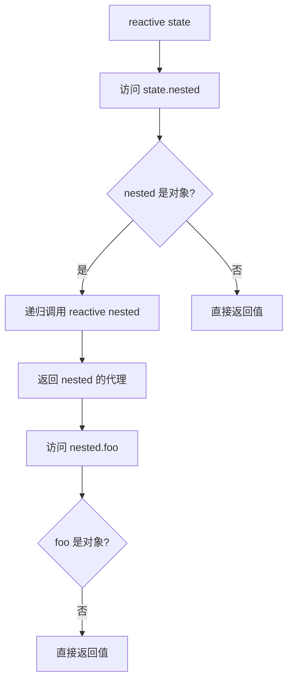

# 从零实现一个响应式系统（一）：Proxy 篇

> 本文是 Lyt.js 技术博客系列的第一篇，我们将深入探讨基于 ES6 Proxy 的响应式系统实现原理。通过从零开始编写一个简化版的 `reactive()`，你将理解现代前端框架响应式底层的核心机制。

## 目录

- [为什么需要响应式系统](#为什么需要响应式系统)
- [Proxy vs Object.defineProperty 对比](#proxy-vs-objectdefineproperty-对比)
- [Lyt.js 的 reactive() 实现原理](#lytjs-的-reactive-实现原理)
- [深层 Proxy 代理的实现](#深层-proxy-代理的实现)
- [依赖收集（track）和触发（trigger）机制](#依赖收集track和触发trigger机制)
- [数组方法拦截](#数组方法拦截)
- [WeakMap 缓存策略](#weakmap-缓存策略)
- [从零实现一个简化版的 reactive](#从零实现一个简化版的-reactive)
- [总结](#总结)
- [下一篇预告](#下一篇预告)

## 为什么需要响应式系统

在前端开发中，UI 是数据的映射。当数据变化时，UI 需要自动更新。如果没有响应式系统，我们需要手动操作 DOM：

```js
// 没有响应式系统
const state = { count: 0 }
document.getElementById('counter').textContent = state.count

// 每次修改数据后，手动更新 DOM
state.count++
document.getElementById('counter').textContent = state.count
```

响应式系统的目标就是**自动追踪数据依赖，在数据变化时自动触发更新**：

```js
// 有响应式系统
const state = reactive({ count: 0 })
effect(() => {
  document.getElementById('counter').textContent = state.count
})
state.count++ // 自动触发 effect 重新执行
```

Lyt.js 的响应式系统基于 ES6 Proxy 实现，这是目前主流前端框架（Vue 3、MobX 等）采用的技术方案。

## Proxy vs Object.defineProperty 对比

在 Vue 2 时代，响应式系统基于 `Object.defineProperty` 实现。Lyt.js（以及 Vue 3）选择了 Proxy，原因如下：

| 特性 | Object.defineProperty | Proxy |
|------|----------------------|-------|
| 新增属性检测 | 需要 `$set` 辅助方法 | 自动拦截 |
| 删除属性检测 | 需要 `$delete` 辅助方法 | 自动拦截 |
| 数组索引修改 | 无法检测 | 自动拦截 |
| 数组 length 修改 | 部分支持 | 自动拦截 |
| 性能 | 初始化时递归遍历所有属性 | 惰性代理，按需创建 |
| 深层嵌套 | 初始化时全部递归 | 访问时递归（惰性） |

Proxy 的核心优势在于**可以拦截整个对象的所有操作**，而不是逐个属性定义 getter/setter：

```js
// Object.defineProperty：逐个属性拦截
Object.defineProperty(obj, 'count', {
  get() { /* ... */ },
  set(newVal) { /* ... */ }
})

// Proxy：拦截整个对象
const proxy = new Proxy(obj, {
  get(target, key) { /* 拦截所有属性读取 */ },
  set(target, key, value) { /* 拦截所有属性设置 */ }
})
```

## Lyt.js 的 reactive() 实现原理

Lyt.js 的 `reactive()` 函数位于 `@lytjs/reactivity` 包的 `reactive.ts` 文件中。其核心实现如下：

```ts
export function reactive<T extends object>(
  target: T,
  options: ReactiveOptions = {}
): T {
  if (!isObject(target)) {
    return target
  }
  if ((target as any)[reactiveFlag]) {
    return target  // 已经是代理对象，直接返回
  }
  if ((target as any)[readonlyFlag]) {
    return readonly(target)  // 只读对象返回只读代理
  }
  const existingProxy = proxyMap.get(target)
  if (existingProxy) {
    return existingProxy  // 缓存命中，返回已有代理
  }
  const proxy = new Proxy(target, mutableHandlers) as T
  proxyMap.set(target, proxy)
  return proxy
}
```

关键设计点：

1. **类型守卫**：只对对象类型创建代理，基本类型直接返回
2. **防重复代理**：通过 `reactiveFlag` 标记避免对代理对象再次代理
3. **缓存机制**：使用 `WeakMap` 确保同一原始对象始终返回同一代理
4. **三种模式**：`mutableHandlers`（可变）、`readonlyHandlers`（只读）、`shallowReactiveHandlers`（浅层）

## 深层 Proxy 代理的实现

深层代理采用**惰性递归**策略：不是在创建代理时递归代理所有嵌套对象，而是在访问嵌套属性时按需代理。

```ts
const mutableHandlers: ProxyHandler<object> = {
  get(target: object, key: string | symbol, receiver: object): any {
    // ... 特殊处理 ...

    // 依赖收集
    track(target, key)

    const res = Reflect.get(target, key, receiver)

    // 基本类型不需要代理
    if (!isObject(res)) {
      return res
    }

    // 跳过标记的对象
    if ((target as any)[skipFlag]) {
      return res
    }

    // 深层代理：对嵌套对象递归代理
    return reactive(res)
  },
  // ...
}
```

这种惰性策略的优势：



## 依赖收集（track）和触发（trigger）机制

Lyt.js 使用三层嵌套数据结构来管理依赖关系：

```
targetMap: WeakMap<object, Map<key, Set<ReactiveEffect>>>
  └── target (原始对象)
       └── depsMap: Map<key, Set<ReactiveEffect>>
            └── key (属性名)
                 └── dep: Set<ReactiveEffect> (依赖该属性的副作用集合)
```

### 依赖收集（track）

当读取响应式属性时，将当前活跃的副作用记录到依赖集合中：

```ts
export function track(target: object, key: unknown): void {
  if (!shouldTrack) return
  if (!activeEffect) return

  let depsMap = targetMap.get(target)
  if (!depsMap) {
    depsMap = new Map()
    targetMap.set(target, depsMap)
  }

  let dep = depsMap.get(key)
  if (!dep) {
    dep = new Set()
    depsMap.set(key, dep)
  }

  if (!dep.has(activeEffect)) {
    dep.add(activeEffect)
    activeEffect.deps.add(dep)  // 双向引用，用于清理
  }
}
```

### 触发更新（trigger）

当修改响应式属性时，通知所有依赖该属性的副作用重新执行：

```ts
export function trigger(
  target: object,
  key: unknown,
  type: TriggerOpTypes,
  newValue?: any
): void {
  const depsMap = targetMap.get(target)
  if (!depsMap) return

  const effectsToRun: Set<ReactiveEffect> = new Set()

  // 1. 触发具体 key 的依赖
  addEffects(depsMap.get(key))

  // 2. 新增/删除操作触发 ITERATE_KEY 依赖
  if (type === 'add' || type === 'delete') {
    addEffects(depsMap.get(ITERATE_KEY))
  }

  // 3. 数组 length 变化触发索引依赖
  if (type === 'set' && Array.isArray(target)) {
    // ...
  }

  for (const effect of effectsToRun) {
    if (effect.scheduler) {
      effect.scheduler(effect)  // 通过调度器延迟执行
    } else {
      effect.run()  // 直接执行
    }
  }
}
```

## 数组方法拦截

数组有一些特殊的方法需要额外处理。Lyt.js 将数组方法分为两类：

### 搜索类方法

`includes`、`indexOf`、`lastIndexOf` 内部会遍历数组元素，必须对每个索引进行 track：

```ts
['includes', 'indexOf', 'lastIndexOf'].forEach(method => {
  arrayInstrumentations[method] = function(this: any[], ...args: any[]) {
    const arr = toRaw(this)
    // 追踪每个元素的依赖
    for (let i = 0; i < arr.length; i++) {
      track(arr, String(i))
    }
    track(arr, 'length')
    return (arr as any)[method](...args)
  }
})
```

### 变异类方法

`push`、`pop`、`shift`、`unshift`、`splice`、`sort`、`reverse` 会修改数组内容：

```ts
['push', 'pop', 'shift', 'unshift', 'splice', 'sort', 'reverse'].forEach(method => {
  arrayInstrumentations[method] = function(this: any[], ...args: any[]) {
    pauseTracking()  // 暂停依赖收集
    const res = (Array.prototype as any)[method].apply(this, args)
    resetTracking()
    // 手动触发 length 依赖更新
    trigger(toRaw(this), 'length', 'set', toRaw(this).length)
    return res
  }
})
```

注意：某些数组方法（如 `push`）内部通过 `[[DefineOwnProperty]]` 修改 `length`，不会触发 Proxy 的 `set` 拦截器，因此需要手动触发。

## WeakMap 缓存策略

Lyt.js 使用三个独立的 `WeakMap` 来缓存不同类型的代理：

```ts
const proxyMap = new WeakMap<object, Record<string, unknown>>()        // 可变代理
const readonlyMap = new WeakMap<object, Record<string, unknown>>()      // 只读代理
const shallowReactiveMap = new WeakMap<object, Record<string, unknown>>() // 浅层代理
```

使用 `WeakMap` 的原因：

1. **内存安全**：当原始对象被垃圾回收时，对应的代理也会被自动清除
2. **避免内存泄漏**：不会因为代理缓存而阻止原始对象的回收
3. **同一性保证**：对同一个原始对象多次调用 `reactive()` 始终返回同一个代理

```ts
const obj = { count: 0 }
const proxy1 = reactive(obj)
const proxy2 = reactive(obj)
console.log(proxy1 === proxy2)  // true，同一个代理
```

## 从零实现一个简化版的 reactive

下面是一个完整的简化版响应式系统实现：

```ts
// ============ 依赖收集系统 ============

const targetMap = new WeakMap<object, Map<string | symbol, Set<Effect>>>()
let activeEffect: Effect | null = null
const effectStack: Effect[] = []

class Effect {
  fn: () => any
  deps: Set<Set<Effect>> = new Set()

  constructor(fn: () => any) {
    this.fn = fn
  }

  run() {
    effectStack.push(this)
    activeEffect = this
    this.cleanup()
    const result = this.fn()
    effectStack.pop()
    activeEffect = effectStack[effectStack.length - 1] || null
    return result
  }

  cleanup() {
    for (const dep of this.deps) {
      dep.delete(this)
    }
    this.deps.clear()
  }
}

function track(target: object, key: string | symbol) {
  if (!activeEffect) return
  let depsMap = targetMap.get(target)
  if (!depsMap) {
    depsMap = new Map()
    targetMap.set(target, depsMap)
  }
  let dep = depsMap.get(key)
  if (!dep) {
    dep = new Set()
    depsMap.set(key, dep)
  }
  if (!dep.has(activeEffect)) {
    dep.add(activeEffect)
    activeEffect.deps.add(dep)
  }
}

function trigger(target: object, key: string | symbol) {
  const depsMap = targetMap.get(target)
  if (!depsMap) return
  const dep = depsMap.get(key)
  if (!dep) return
  const effectsToRun = new Set(dep)
  for (const effect of effectsToRun) {
    effect.run()
  }
}

function effect(fn: () => any) {
  const e = new Effect(fn)
  e.run()
  return e.run.bind(e)
}

// ============ reactive 实现 ============

const proxyMap = new WeakMap<object, any>()
const reactiveMap = new WeakMap<any, object>()
const RAW = Symbol('raw')
const IS_REACTIVE = Symbol('reactive')

function isObject(val: unknown): val is object {
  return val !== null && typeof val === 'object'
}

function reactive<T extends object>(target: T): T {
  if (!isObject(target)) return target

  // 已代理 → 返回原始对象
  if ((target as any)[IS_REACTIVE]) {
    return (reactiveMap.get(target) || target) as T
  }

  // 缓存命中
  const existing = proxyMap.get(target)
  if (existing) return existing

  const proxy = new Proxy(target, {
    get(target, key, receiver) {
      if (key === RAW) return target
      if (key === IS_REACTIVE) return true

      track(target, key)

      const res = Reflect.get(target, key, receiver)
      if (isObject(res)) {
        return reactive(res)  // 惰性深层代理
      }
      return res
    },

    set(target, key, value, receiver) {
      const oldValue = (target as any)[key]
      const result = Reflect.set(target, key, value, receiver)

      if (target === (receiver as any)?.[RAW]) {
        if (oldValue !== value) {
          trigger(target, key)
        }
      }
      return result
    },

    deleteProperty(target, key) {
      const hadKey = Object.prototype.hasOwnProperty.call(target, key)
      const result = Reflect.deleteProperty(target, key)
      if (result && hadKey) {
        trigger(target, key)
      }
      return result
    },
  })

  proxyMap.set(target, proxy)
  reactiveMap.set(proxy, target)
  return proxy
}

// ============ 使用示例 ============

const state = reactive({
  count: 0,
  nested: { name: 'Lyt.js' },
  items: [1, 2, 3],
})

effect(() => {
  console.log(`count = ${state.count}`)
})
// 输出: count = 0

state.count++
// 输出: count = 1

effect(() => {
  console.log(`name = ${state.nested.name}`)
})
// 输出: name = Lyt.js

state.nested.name = 'Hello'
// 输出: name = Hello
```

## 总结

本文深入分析了 Lyt.js 基于 Proxy 的响应式系统实现：

1. **Proxy 优于 Object.defineProperty**：能拦截对象的所有操作，包括新增/删除属性和数组方法
2. **惰性深层代理**：访问嵌套属性时才创建代理，避免初始化时的性能开销
3. **三层依赖结构**：`WeakMap → Map → Set` 精确管理属性与副作用的关系
4. **数组方法特殊处理**：搜索类方法追踪每个元素，变异类方法暂停追踪并手动触发 length 更新
5. **WeakMap 缓存**：确保同一原始对象返回同一代理，且不造成内存泄漏

## 下一篇预告

在下一篇中，我们将探讨 Lyt.js 的 Signal 响应式系统 -- 一种完全不同的细粒度响应式方案。我们将对比 Proxy 和 Signal 的本质区别，了解 Signal 的自动依赖收集、惰性计算和批量更新机制。
