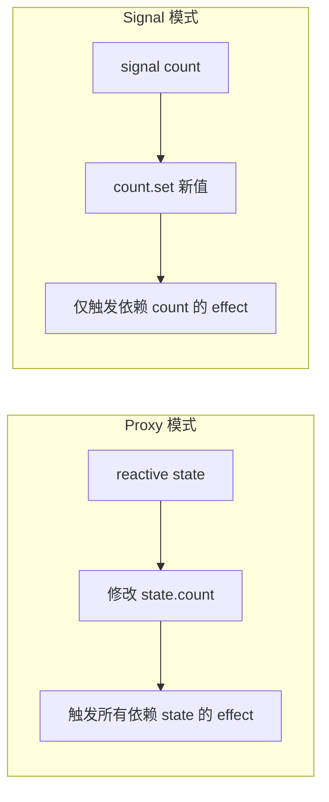
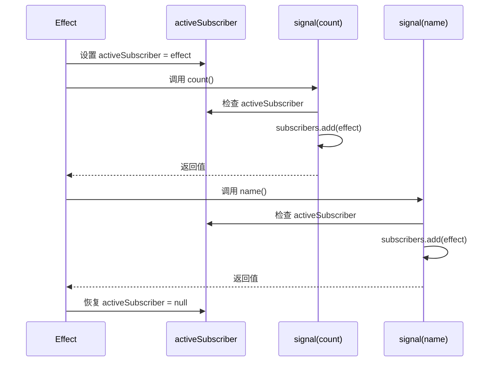

# 从零实现一个响应式系统（二）：Signal 篇

> 本文是 Lyt.js 响应式系统系列的第二篇。我们将深入探讨 Signal 响应式范式 -- 一种源自 Solid.js、被 Angular Signals 和 Preact Signals 采用的细粒度响应式方案。Lyt.js 在 Proxy 响应式之外，完整实现了 Signal 系统，两者可以互操作。

## 目录

- [Signal 响应式的起源](#signal-响应式的起源)
- [Signal 的核心概念（细粒度更新）](#signal-的核心概念细粒度更新)
- [Lyt.js 的 signal() 实现原理](#lytjs-的-signal-实现原理)
- [自动依赖收集（activeSubscriber）](#自动依赖收集activesubscriber)
- [computed 的惰性求值和缓存](#computed-的惰性求值和缓存)
- [effect 和 cleanup](#effect-和-cleanup)
- [batch 批量更新](#batch-批量更新)
- [Proxy vs Signal 的本质区别](#proxy-vs-signal-的本质区别)
- [总结](#总结)
- [下一篇预告](#下一篇预告)

## Signal 响应式的起源

Signal 并非新概念。它的思想可以追溯到 2006 年的 Microsoft .NET Reactive Extensions (Rx)，以及后来的 MobX (2015)。真正让 Signal 在前端框架中流行起来的是 Solid.js（2021），其作者 Ryan Carniato 证明了**没有虚拟 DOM 也能构建高性能的响应式 UI**。

此后，Angular（v16+）、Preact（v10.4+）、Vue（v3.4 的实验性 API）纷纷引入 Signal。Lyt.js 在 v5.0.0 中原生支持 Signal，并与 Proxy 响应式系统深度集成。

Signal 的核心思想很简单：**将每个值包装为一个可观察的容器，通过函数调用来读取值并自动建立依赖关系**。

```ts
// Signal 的基本用法
const count = signal(0)

// 读取值（调用 signal 函数）
console.log(count())  // 0

// 设置值
count.set(1)
count()  // 1

// 更新值
count.update(prev => prev + 1)
count()  // 2
```

## Signal 的核心概念（细粒度更新）

Signal 的最大特点是**细粒度更新**。与 Proxy 模式（追踪对象属性级别的依赖）不同，Signal 追踪的是**每个独立的值**。



这意味着当 `count` 变化时，只有真正读取了 `count` 的 effect 才会重新执行，而不会波及其他不相关的 effect。

## Lyt.js 的 signal() 实现原理

Lyt.js 的 Signal 实现位于 `@lytjs/reactivity/signal.ts`，纯原生零依赖，无任何 DOM 或浏览器 API 依赖。

```ts
export function signal<T>(initialValue: T): WritableSignal<T> {
  let value: T = initialValue
  const subscribers = new Set<Subscriber>()

  const sig = function SignalGetter(): T {
    // 如果有活跃的订阅者且不在 untrack 模式中，建立依赖
    if (activeSubscriber && !isUntracked) {
      subscribers.add(activeSubscriber)
    }
    return value
  } as WritableSignal<T>

  sig.set = function (newValue: T): void {
    // Object.is 比较，值未变化则不通知
    if (Object.is(value, newValue)) return
    value = newValue
    _notifySubscribers(subscribers)
  }

  sig.update = function (fn: (prev: T) => T): void {
    sig.set(fn(value))
  }

  sig._subscribe = function (subscriber: Subscriber): void {
    subscribers.add(subscriber)
  }

  sig._unsubscribe = function (subscriber: Subscriber): void {
    subscribers.delete(subscriber)
  }

  sig.dispose = function (): void {
    subscribers.clear()
  }

  return sig
}
```

关键设计点：

1. **函数即读取**：Signal 本身是一个函数，调用 `sig()` 即读取值
2. **Object.is 比较**：使用严格相等判断值是否变化，避免 NaN 等边界问题
3. **订阅者集合**：每个 Signal 维护自己的 `subscribers`，变化时只通知相关订阅者
4. **dispose 方法**：提供手动销毁能力，释放所有订阅关系

## 自动依赖收集（activeSubscriber）

Signal 的依赖收集不需要像 Proxy 那样拦截属性访问，而是通过一个**全局变量 `activeSubscriber`** 实现：

```ts
let activeSubscriber: Subscriber | null = null
```

当 effect 或 computed 执行时，将自身设为 `activeSubscriber`。在执行过程中，任何被调用的 Signal 都会将 `activeSubscriber` 加入自己的订阅者集合。



## computed 的惰性求值和缓存

Lyt.js 的 Signal computed 采用**惰性求值 + 脏标记**策略：

```ts
export function computed<T>(fn: () => T): ComputedSignal<T> {
  let cachedValue: T
  let isDirty = true
  let isComputing = false
  const dependencies = new Set<Dependency>()
  const subscribers = new Set<Subscriber>()

  const comp = function ComputedGetter(): T {
    if (activeSubscriber && !isUntracked) {
      subscribers.add(activeSubscriber)
    }

    if (isDirty) {
      // 检测循环依赖
      if (isComputing) {
        throw new LytError('LYT_REACTIVITY_CIRCULAR_DEPENDENCY',
          'computed 在其自身的计算图中')
      }
      isComputing = true

      // 清除旧依赖
      for (const dep of dependencies) {
        dep._unsubscribe(comp as unknown as Subscriber)
      }
      dependencies.clear()

      // 收集新依赖
      const prevSubscriber = activeSubscriber
      activeSubscriber = comp as unknown as Subscriber
      try {
        cachedValue = fn()
      } finally {
        activeSubscriber = prevSubscriber
        isComputing = false
      }
      isDirty = false
    }

    return cachedValue
  } as ComputedSignal<T>

  // 当依赖变化时，标记为 dirty 并通知下游
  const subscriberImpl: Subscriber = {
    _dirty: false,
    notify(): void {
      isDirty = true
      _notifySubscribers(subscribers)
    },
  }

  comp.notify = subscriberImpl.notify.bind(subscriberImpl)
  comp._dirty = false
  comp._subscribe = function (subscriber: Subscriber): void {
    subscribers.add(subscriber)
  }
  comp._unsubscribe = function (subscriber: Subscriber): void {
    subscribers.delete(subscriber)
  }

  return comp
}
```

关键特性：

1. **惰性求值**：只有在被读取时才计算，不读取就不计算
2. **脏标记缓存**：依赖未变化时直接返回缓存值
3. **循环依赖检测**：通过 `isComputing` 标志防止无限递归
4. **依赖自动更新**：每次计算时清除旧依赖、收集新依赖

```ts
const count = signal(1)
const double = computed(() => count() * 2)

console.log(double())  // 2（首次计算）
console.log(double())  // 2（缓存命中，不重新计算）

count.set(5)
console.log(double())  // 10（依赖变化，重新计算）
```

## effect 和 cleanup

Signal 的 effect 与 Proxy 的 effect 类似，但增加了 **cleanup 回调**机制：

```ts
export function effect(
  fn: (onCleanup: (cleanup: EffectCleanup) => void) => void
): () => void {
  let cleanupFn: EffectCleanup | null = null
  let isDisposed = false
  const dependencies = new Set<Dependency>()

  const run = (): void => {
    if (isDisposed) return

    // 执行清理
    if (cleanupFn) {
      cleanupFn()
      cleanupFn = null
    }

    // 清除旧依赖
    for (const dep of dependencies) {
      dep._unsubscribe(effectSubscriber)
    }
    dependencies.clear()

    // 设置为活跃订阅者以收集新依赖
    const prevSubscriber = activeSubscriber
    activeSubscriber = effectSubscriber
    try {
      fn((cleanup: EffectCleanup) => {
        cleanupFn = cleanup
      })
    } finally {
      activeSubscriber = prevSubscriber
    }
  }

  const effectSubscriber: Subscriber = {
    _dirty: false,
    notify(): void {
      if (batchDepth > 0) {
        pendingNotifications.add(effectSubscriber)
      } else {
        run()
      }
    },
  }

  run()  // 首次执行

  return (): void => {
    isDisposed = true
    if (cleanupFn) { cleanupFn(); cleanupFn = null }
    for (const dep of dependencies) {
      dep._unsubscribe(effectSubscriber)
    }
    dependencies.clear()
    pendingNotifications.delete(effectSubscriber)
  }
}
```

cleanup 回调的典型使用场景：

```ts
const searchQuery = signal('')

const dispose = effect((onCleanup) => {
  // 模拟异步搜索
  const timer = setTimeout(() => {
    console.log(`Searching: ${searchQuery()}`)
  }, 300)

  // 注册清理函数：依赖变化时取消上一次的搜索
  onCleanup(() => {
    clearTimeout(timer)
    console.log('Previous search cancelled')
  })
})

searchQuery.set('hello')
// 输出: Previous search cancelled

dispose()  // 停止 effect
```

## batch 批量更新

当一次操作中修改多个 Signal 时，batch 可以合并更新，避免重复执行 effect：

```ts
export function batch(fn: () => void): void {
  batchDepth++
  try {
    fn()
  } finally {
    batchDepth--
    if (batchDepth === 0) {
      _flushPending()
    }
  }
}

function _flushPending(): void {
  if (isFlushing) return
  isFlushing = true
  try {
    const snapshot = new Set(pendingNotifications)
    pendingNotifications.clear()
    for (const subscriber of snapshot) {
      subscriber.notify()
    }
    if (pendingNotifications.size > 0) {
      _flushPending()  // 处理 flush 过程中新增的通知
    }
  } finally {
    isFlushing = false
  }
}
```

```ts
const firstName = signal('Lyt')
const lastName = signal('JS')
const fullName = computed(() => `${firstName()} ${lastName()}`)

effect(() => console.log(fullName()))
// 输出: Lyt JS

// 没有 batch：effect 执行两次
firstName.set('Hello')
lastName.set('World')
// 输出: Hello JS
// 输出: Hello World

// 使用 batch：effect 只执行一次
batch(() => {
  firstName.set('Hello')
  lastName.set('World')
})
// 输出: Hello World（只执行一次）
```

## Proxy vs Signal 的本质区别

| 维度 | Proxy (reactive) | Signal |
|------|-----------------|--------|
| 粒度 | 对象属性级别 | 独立值级别 |
| 依赖收集 | 拦截 get 操作 | 全局 activeSubscriber |
| API 风格 | `state.count` | `count()` |
| 基本类型 | 需要 ref 包装 | 直接支持 |
| 深层嵌套 | 自动递归代理 | 需要手动创建嵌套 signal |
| 内存模型 | WeakMap 缓存代理 | 每个 signal 独立存储 |
| 与 VDOM 配合 | 天然适配 | 需要额外适配层 |
| 与无 VDOM 配合 | 困难 | 天然适配（Vapor Mode） |

Proxy 模式更接近"声明式"风格，写法自然；Signal 模式更接近"命令式"风格，但提供了更精确的更新粒度和更好的性能。

## 总结

本文深入分析了 Lyt.js 的 Signal 响应式系统：

1. **Signal 是函数**：调用即读取，`set()` 即更新，API 极简
2. **自动依赖收集**：通过全局 `activeSubscriber` 在 effect/computed 执行时自动追踪
3. **惰性 computed**：脏标记 + 缓存，只在需要时计算
4. **cleanup 机制**：effect 支持清理回调，处理异步竞态等场景
5. **batch 批量更新**：合并多次 Signal 更新，减少 effect 执行次数

## 下一篇预告

在下一篇中，我们将探讨 Lyt.js 的双响应式架构 -- Proxy 和 Signal 如何互操作，以及在实际项目中如何选择和混用两种响应式范式。
