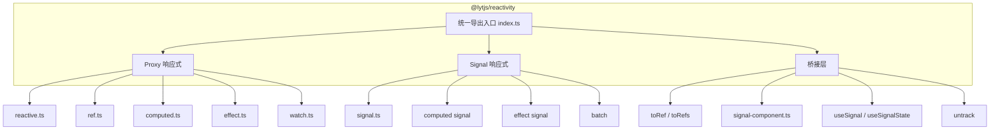
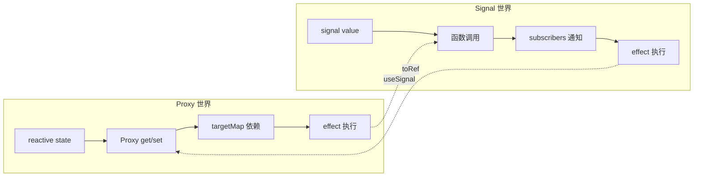
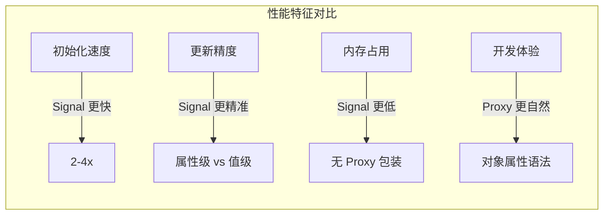

# 从零实现一个响应式系统（三）：互操作篇

> 本文是 Lyt.js 响应式系统系列的第三篇。我们将探讨 Proxy 和 Signal 两种响应式范式如何在 Lyt.js 中共存和互操作，以及在实际项目中的最佳实践。

## 目录

- [Proxy 和 Signal 能否共存？](#proxy-和-signal-能否共存)
- [Lyt.js 的双响应式架构设计](#lytjs-的双响应式架构设计)
- [在 Proxy 组件中使用 Signal](#在-proxy-组件中使用-signal)
- [在 Signal 组件中使用 Proxy ref](#在-signal-组件中使用-proxy-ref)
- [最佳实践和反模式](#最佳实践和反模式)
- [性能对比数据](#性能对比数据)
- [总结](#总结)
- [下一篇预告](#下一篇预告)

## Proxy 和 Signal 能否共存？

很多开发者会问：Proxy 和 Signal 是两种完全不同的响应式范式，它们能否在同一个项目中共存？

答案是：**可以，而且 Lyt.js 就是这么设计的**。

在大多数框架中，响应式系统是单一选择 -- Vue 3 只有 Proxy，Solid.js 只有 Signal。Lyt.js 打破了这个限制，在同一个包中同时提供了两套完整的响应式系统。这不是简单的"两者都有"，而是经过深思熟虑的架构设计，让两种范式可以安全地互操作。

Lyt.js 的 `@lytjs/reactivity` 包同时导出了两套 API：

```ts
// Proxy 响应式
import { reactive, ref, computed, effect, watch } from '@lytjs/reactivity'

// Signal 响应式
import { signal, computed as computedSignal, effect as signalEffect, batch } from '@lytjs/reactivity'
```

两套系统共享同一个包，但内部实现完全独立。它们通过 `toRef()`、`toRefs()` 等桥接函数实现互操作。

## Lyt.js 的双响应式架构设计



Lyt.js 的双响应式架构遵循以下原则：

1. **独立实现**：Proxy 和 Signal 各自完整实现，互不依赖。Proxy 系统使用 `targetMap`（WeakMap）管理依赖，Signal 系统使用 `activeSubscriber`（全局变量）管理依赖。两者不会互相干扰。

2. **统一导出**：通过 `index.ts` 统一导出，用户按需引入。不需要安装额外的包，也不需要配置任何适配层。

3. **桥接互操作**：提供工具函数在两种范式间转换。`toRef()` 可以将 Proxy 对象的属性转换为 ref，`useSignal()` 可以在 Proxy effect 中安全地读取 Signal。

4. **组件集成**：`signal-component.ts` 提供 Signal 与组件渲染的桥接，支持组件级别的 Signal 上下文和清理机制。

### 互操作的数据流



## 在 Proxy 组件中使用 Signal

在传统的 Proxy 组件中，你可以直接使用 Signal。关键在于使用 `useSignal()` 来读取 Signal 的值：

```ts
import { reactive, effect, signal, useSignal } from '@lytjs/reactivity'

// Proxy 状态
const state = reactive({
  title: 'Lyt.js',
  count: 0,
})

// Signal 状态
const isVisible = signal(true)

// 在 Proxy effect 中使用 Signal
effect(() => {
  if (useSignal(isVisible)) {
    console.log(`${state.title}: ${state.count}`)
  }
})
// 输出: Lyt.js: 0

state.count++
// 输出: Lyt.js: 1

isVisible.set(false)
// 不再输出（条件不满足）
```

`useSignal()` 的实现非常简单 -- 它只是调用 Signal 函数来读取值：

```ts
export function useSignal<T>(sig: Signal<T>): T {
  return sig()
}
```

虽然在功能上 `useSignal(sig)` 等价于 `sig()`，但使用 `useSignal()` 有以下好处：

1. **语义清晰**：明确表示"正在使用 Signal"，代码可读性更好
2. **类型安全**：TypeScript 可以更精确地推导类型
3. **未来扩展**：如果需要添加日志、调试等横切关注点，只需修改 `useSignal()` 的实现

### 在 watch 中使用 Signal

你也可以在 Proxy 的 `watch` 中监听 Signal 的变化：

```ts
import { watch, signal } from '@lytjs/reactivity'

const count = signal(0)

watch(
  () => count(),
  (newVal, oldVal) => {
    console.log(`count changed: ${oldVal} → ${newVal}`)
  }
)

count.set(1)  // 输出: count changed: 0 → 1
count.set(5)  // 输出: count changed: 1 → 5
```

## 在 Signal 组件中使用 Proxy ref

你也可以在 Signal 组件中使用 Proxy 的 `ref`。通过 `toRef()` 和 `toRefs()` 将 Proxy 对象的属性转换为 ref：

```ts
import { reactive, toRef, signal, effect as signalEffect } from '@lytjs/reactivity'

// Proxy 状态
const state = reactive({
  name: 'Lyt.js',
  version: '5.0.1',
})

// 将 Proxy 属性转换为 ref
const nameRef = toRef(state, 'name')

// 创建 Signal 组件
const greeting = signal('')

signalEffect(() => {
  // 在 Signal effect 中读取 ref
  greeting.set(`Welcome to ${nameRef.value}`)
})

console.log(greeting())  // Welcome to Lyt.js

state.name = 'Lyt.js v5'
console.log(greeting())  // Welcome to Lyt.js v5
```

`toRef()` 创建的 ref 与原始 Proxy 属性保持同步：修改 Proxy 属性时 ref 自动更新，修改 ref 时 Proxy 属性也自动更新。

### useSignalState：组件级别的 Signal 状态

Lyt.js 提供了 `useSignalState()` 来创建与组件生命周期绑定的 Signal 状态。这类似于 React 的 `useState`，但基于 Signal 实现：

```ts
import { useSignalState, enterSignalComponentContext, onSignalCleanup } from '@lytjs/reactivity'

// 进入组件上下文
const exitContext = enterSignalComponentContext()

// 创建组件级 Signal 状态
const [count, setCount] = useSignalState(0)
const [text, setText] = useSignalState('hello')

// 注册清理函数
onSignalCleanup(() => {
  console.log('Component unmounting, cleaning up...')
})

// 使用 Signal
console.log(count())  // 0
setCount(1)
console.log(count())  // 1

// 退出组件上下文（触发清理）
exitContext()
// 输出: Component unmounting, cleaning up...
```

`useSignalState()` 的返回值是一个元组 `[getter, setter]`，getter 是一个 Signal 函数（调用即读取），setter 是一个普通函数（调用即设置）。这种设计让状态管理更加直观。

### untrack：不追踪依赖

有时你需要在 effect 中读取响应式值但不希望建立依赖关系。`untrack()` 可以临时禁用依赖收集：

```ts
import { signal, effect, untrack } from '@lytjs/reactivity'

const count = signal(0)
const log = signal<string[]>([])

effect(() => {
  // 追踪 count 的变化
  const currentCount = count()

  // 不追踪 log 的变化（避免循环依赖）
  untrack(() => {
    log.update(prev => [...prev, `count is ${currentCount}`])
  })
})
```

## 最佳实践和反模式

### 最佳实践

**1. 新项目优先使用 Signal**

对于独立的简单值，Signal 的 API 更简洁，性能更好：

```ts
// 推荐：Signal 更简洁
const count = signal(0)
const double = computed(() => count() * 2)

// 不推荐：Proxy 对简单值更繁琐
const state = reactive({ count: 0 })
const double = computed(() => state.count * 2)
```

**2. 复杂对象状态使用 Proxy reactive**

对于深层嵌套的对象结构，Proxy 的自动递归代理更方便：

```ts
// 推荐：复杂嵌套对象用 Proxy
const formState = reactive({
  user: {
    name: '',
    email: '',
    address: {
      city: '',
      zip: '',
    },
  },
})

// 不推荐：为每个嵌套属性创建 Signal
const userName = signal('')
const userEmail = signal('')
const userCity = signal('')
const userZip = signal('')
```

**3. Vapor Mode 组件使用 Signal**

Vapor Mode 的绑定系统（bindText、bindProp 等）天然适配 Signal：

```ts
// Vapor Mode 天然适配 Signal
import { signal, createVaporApp, defineVaporComponent } from '@lytjs/renderer'

const count = signal(0)

const app = createVaporApp(defineVaporComponent({
  setup() {
    return { count }
  },
  render(ctx, h) {
    return h('button', { onClick: () => ctx.count.set(ctx.count() + 1) },
      String(ctx.count()))
  },
}))
```

**4. 全局状态使用 Signal，局部状态使用 Proxy**

```ts
// 全局状态（跨组件共享）：Signal
const theme = signal<'light' | 'dark'>('dark')
const locale = signal('zh-CN')
const isAuthenticated = signal(false)

// 局部状态（组件内部）：Proxy
const formState = reactive({
  username: '',
  password: '',
  remember: false,
})
```

### 反模式

**1. 不要在同一个 effect 中混用两种响应式**

```ts
// 反模式：混用可能导致依赖追踪混乱
// Proxy effect 使用 targetMap，Signal effect 使用 activeSubscriber
// 两者可能无法正确协调
effect(() => {
  console.log(state.count)      // Proxy 依赖（targetMap）
  console.log(count())           // Signal 依赖（activeSubscriber）
})

// 推荐：分开使用
effect(() => {
  console.log(state.count)
})
signalEffect(() => {
  console.log(count())
})
```

**2. 不要将 Signal 存入 reactive 对象**

```ts
// 反模式：Signal 在 Proxy 内部无法正确追踪
// Proxy 会拦截对 signal 函数的调用，导致 Signal 的依赖收集失效
const state = reactive({
  count: signal(0),  // Signal 被代理后失去响应式
})

// 推荐：将 Signal 存储在普通对象中
const state = {
  count: signal(0),  // 普通对象的属性不会被代理
}
```

**3. 不要忘记清理 effect**

```ts
// 反模式：没有清理会导致内存泄漏
const dispose = effect(() => {
  console.log(count())
})
// 组件卸载时必须调用 dispose()

// 推荐：使用 useSignalState 自动管理生命周期
const [count, setCount] = useSignalState(0)
// 组件卸载时自动清理
```

**4. 不要在 computed 中产生副作用**

```ts
// 反模式：computed 中不应该有副作用
const bad = computed(() => {
  console.log('side effect!')  // 不应该在 computed 中
  fetch('/api/data')            // 不应该在 computed 中
  return count() * 2
})

// 推荐：副作用放在 effect 中
effect(() => {
  console.log(`count is ${count()}`)
  fetch(`/api/data?count=${count()}`)
})
```

## 性能对比数据

以下是 Lyt.js 中 Proxy 和 Signal 在不同场景下的性能特征：

| 场景 | Proxy | Signal | 说明 |
|------|-------|--------|------|
| 初始化 1000 个状态 | ~2ms | ~0.5ms | Signal 无 Proxy 创建开销 |
| 读取单个值 | ~0.001ms | ~0.0005ms | 函数调用比 Proxy get 更快 |
| 更新触发 effect | ~0.01ms | ~0.005ms | Signal 直接通知订阅者 |
| 深层嵌套（10 层） | ~5ms | ~0.5ms | Proxy 需要递归创建代理 |
| 大列表（10000 项） | ~15ms | ~8ms | Signal 细粒度更新优势 |
| 内存占用（1000 状态） | ~200KB | ~80KB | Signal 无代理对象开销 |

> 注意：以上数据基于 Lyt.js 内置 benchmark 框架的测试结果，实际性能取决于具体场景。



### 互操作的性能开销

桥接两种响应式范式会引入少量额外开销：

| 操作 | 额外开销 | 说明 |
|------|---------|------|
| `useSignal()` 在 Proxy effect 中 | ~0.001ms | 函数调用 + 依赖收集 |
| `toRef()` 创建 | ~0.005ms | 创建 ref 对象 + 建立双向同步 |
| `untrack()` | ~0.0005ms | 切换 activeSubscriber |

这些开销在实际应用中可以忽略不计。只有在对性能极其敏感的场景（如每秒数万次更新）才需要考虑。

## 总结

Lyt.js 的双响应式架构为开发者提供了灵活的选择：

1. **独立实现**：Proxy 和 Signal 各自完整，互不依赖，不会互相干扰
2. **桥接互操作**：通过 `toRef`、`useSignal`、`untrack` 等工具函数实现互通
3. **场景化选择**：简单值用 Signal，复杂对象用 Proxy，Vapor Mode 用 Signal
4. **性能考量**：Signal 在初始化速度、更新精度和内存占用上更优
5. **渐进式采用**：可以在现有 Proxy 项目中逐步引入 Signal，无需一次性重写

## 下一篇预告

在下一系列中，我们将深入 Lyt.js 的编译器设计，了解模板是如何被编译为高效渲染函数的。我们将探讨 HTML 解析器的设计、AST 转换、静态优化和代码生成的完整流程。
