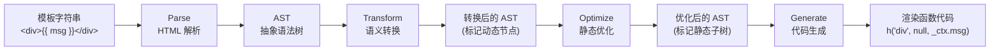
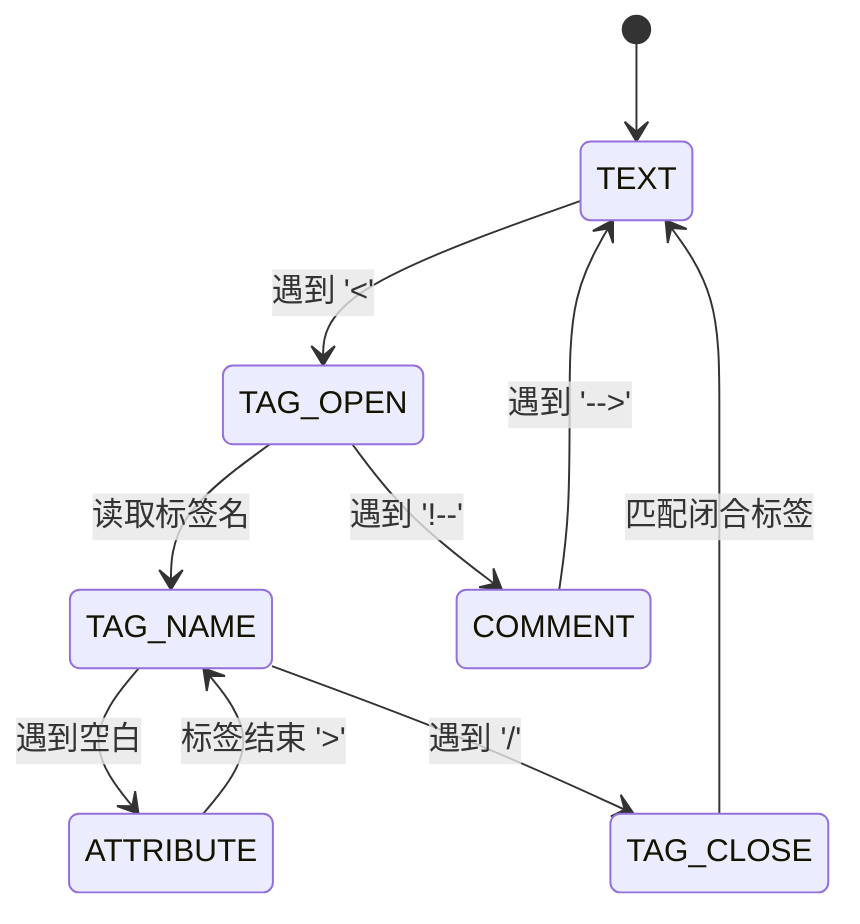
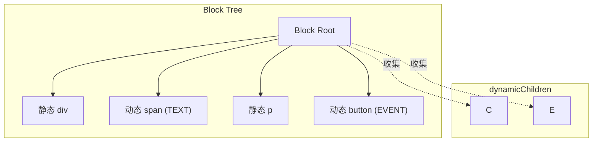

# Lyt.js 编译器设计（一）：模板编译篇

> 本文是 Lyt.js 编译器设计系列的第一篇。我们将深入探讨 Lyt.js 模板编译器的四阶段流程：HTML 解析、AST 转换、静态优化和代码生成。

## 目录

- [模板编译器的四阶段流程](#模板编译器的四阶段流程)
- [HTML 解析器设计](#html-解析器设计)
- [AST 转换（指令处理）](#ast-转换指令处理)
- [静态优化（Static Hoisting）](#静态优化static-hoisting)
- [Patch Flags 精确标记](#patch-flags-精确标记)
- [Block Tree 动态追踪](#block-tree-动态追踪)
- [代码生成](#代码生成)
- [总结](#总结)
- [下一篇预告](#下一篇预告)

## 模板编译器的四阶段流程

Lyt.js 的模板编译器将 HTML 模板字符串转换为可执行的渲染函数代码，经过以下四个阶段：



完整的编译流程入口：

```ts
export function compile(template: string, options: CompileOptions = {}): CompileResult {
  // 阶段 1：解析
  const ast = parseHTML(template)
  // 阶段 2：转换
  transform(ast, options.transform)
  // 阶段 3：优化
  const hoistResult = optimize(ast)
  // 阶段 4：代码生成
  const codegenResult = generate(ast, options.codegen)

  return { code: codegenResult.code, ast, hoistResult, helpers: codegenResult.helpers }
}
```

## HTML 解析器设计

Lyt.js 的 HTML 解析器基于**有限状态机**实现，支持标签、属性、文本、注释和表达式插值。

### 解析状态

```ts
const enum ParseState {
  TEXT,       // 文本内容
  TAG_OPEN,   // 遇到 '<'
  TAG_NAME,   // 解析标签名
  ATTRIBUTE,  // 解析属性
  TAG_CLOSE,  // 解析闭合标签
  COMMENT,    // 解析注释
}
```

### 解析流程



解析器的核心是 `ParserContext` 类，维护解析过程中的所有状态：

```ts
class ParserContext {
  template: string
  pos: number
  line: number
  column: number
  state: ParseState
  root: RootNode
  currentElement: ElementNode | null
  parentStack: ElementNode[]
  textBuffer: string
  // ... 更多状态
}
```

### 指令识别

解析器在解析属性时，会自动识别 Lyt.js 的指令语法：

| 语法 | 指令 | 示例 |
|------|------|------|
| `v-if="expr"` | 条件渲染 | `<div v-if="show">` |
| `v-each="item in list"` | 列表渲染 | `<li v-each="item in items">` |
| `v-bind:prop="expr"` 或 `:prop="expr"` | 属性绑定 | `<div :class="cls">` |
| `v-on:event="handler"` 或 `@event="handler"` | 事件绑定 | `<button @click="fn">` |
| `v-slot:name` 或 `#name` | 插槽分发 | `<template #header>` |
| `v-ref="name"` | 模板引用 | `<div v-ref="myEl">` |

## AST 转换（指令处理）

转换阶段对 AST 进行语义增强，将模板指令转换为更高级的中间表示。

### 转换插件架构

Lyt.js 的转换系统采用**插件化架构**，内置 6 个转换插件：

```ts
const builtInTransforms: NodeTransform[] = [
  transformIfDirective,     // v-if → 条件渲染
  transformEachDirective,   // v-each → 列表渲染
  transformBindDirective,   // v-bind → 属性绑定
  transformOnDirective,     // v-on → 事件绑定
  transformSlotDirective,   // v-slot → 插槽分发
  transformRefDirective,    // v-ref → 模板引用
]
```

每个转换插件接收 AST 节点和转换上下文，可以修改节点或注册退出回调。

### v-if 转换

```ts
function transformIfDirective(node: ASTNode, context: TransformContext): void {
  if (node.type !== 'Element') return
  const ifDirective = node.directives.find(d => d.name === 'if')
  if (!ifDirective) return

  Object.assign(node, {
    ifCondition: ifDirective.value,
    ifBranches: [],
  })
  context.root.helpers.add('createConditionalVNode')
  node.directives = node.directives.filter(d => d !== ifDirective)
}
```

### v-each 转换

```ts
function transformEachDirective(node: ASTNode, context: TransformContext): void {
  if (node.type !== 'Element') return
  const eachDirective = node.directives.find(d => d.name === 'each')
  if (!eachDirective) return

  const eachExpr = parseEachExpression(eachDirective.value)
  if (eachExpr) {
    Object.assign(node, { eachInfo: eachExpr })
    context.root.helpers.add('renderList')
  }
  node.directives = node.directives.filter(d => d !== eachDirective)
}
```

`v-each` 支持三种语法：

```html
<!-- 简单语法 -->
<li v-each="item in items">{{ item }}</li>

<!-- 带索引 -->
<li v-each="(item, index) in items">{{ index }}: {{ item }}</li>

<!-- of 别名 -->
<li v-each="item of items">{{ item }}</li>
```

## 静态优化（Static Hoisting）

静态优化是编译器提升运行时性能的关键手段。Lyt.js 实现了两种互补的优化策略。

### 静态标记（optimize.ts）

对 AST 进行静态分析，标记每个节点的 `staticFlag`：

```ts
// staticFlag 取值
// -1 : 未分析
//  0 : 动态节点
//  1 : 静态节点（可提升）
```

静态节点的判定标准：

1. **文本节点**：不包含 `{{ }}` 表达式插值
2. **元素节点**：没有动态属性、事件绑定、指令，且所有子节点都是静态的

```ts
function markStaticElement(node: ElementNode, result: HoistResult, nameGenerator: () => string): boolean {
  // 有任何动态特征就不是静态的
  if (node.directives.length > 0) return false
  if (nodeAny.ifCondition) return false
  if (nodeAny.eachInfo) return false
  if (nodeAny.bindings?.length > 0) return false
  if (nodeAny.events?.length > 0) return false
  // ... 更多检查

  // 递归检查所有子节点
  let allChildrenStatic = true
  for (const child of node.children) {
    if (!markStatic(child, result, nameGenerator)) {
      allChildrenStatic = false
    }
  }

  if (allChildrenStatic) {
    node.staticFlag = 1
    // 复杂的静态节点可以提升
    if (node.children.length > 0) {
      const name = nameGenerator()
      result.hoistedNodes.push(node)
      result.hoistedNames.push(name)
    }
    return true
  }

  node.staticFlag = 0
  return false
}
```

### 静态提升（transform-static-hoist.ts）

将静态子树提升到渲染函数外部，只创建一次：

```ts
// 提升前
function render(_ctx) {
  return h('div', null, [
    h('span', null, 'static text'),  // 每次渲染都重新创建
    h('p', null, _ctx.message),       // 动态节点
  ])
}

// 提升后
const _hoisted_1 = h('span', null, 'static text')  // 只创建一次

function render(_ctx) {
  return h('div', null, [
    _hoisted_1,                        // 直接复用
    h('p', null, _ctx.message),
  ])
}
```

## Patch Flags 精确标记

Patch Flags 是 Lyt.js 编译时优化的核心机制，为每个动态节点生成精确的更新标记。

```ts
export enum CompilerPatchFlags {
  TEXT = 1,              // 动态文本
  CLASS = 2,             // 动态 class
  STYLE = 4,             // 动态 style
  PROPS = 8,             // 动态 props
  FULL_PROPS = 16,       // 动态 keys + props
  EVENT = 32,            // 动态事件
  SLOTS = 64,            // 动态插槽
  STABLE_FRAGMENT = 128, // 稳定片段
  KEYED_FRAGMENT = 256,  // 带 key 的片段
  UNKEYED_FRAGMENT = 512,// 不带 key 的片段
  NEED_PATCH = 1024,     // 强制补丁
  DYNAMIC_SLOTS = 2048,  // 动态插槽
  HOISTED = -1,          // 静态节点
  BAIL = -2,             // 退出优化
}
```

多个标记可以通过位运算组合：

```ts
// 一个同时有动态 class 和动态文本的节点
patchFlag = CompilerPatchFlags.CLASS | CompilerPatchFlags.TEXT  // = 3
```

运行时 diff 算法根据 patchFlag 只检查标记为动态的部分，跳过静态部分。

## Block Tree 动态追踪

Block Tree 是 Lyt.js 的另一个编译时优化机制。一个 Block 收集其内部的所有动态子节点，重新渲染时只对动态子节点进行 diff。



```ts
export function createBlock(tag: string, props: Record<string, any> | null = null,
  children: VNode[] | string | null = null, patchFlag: number = 0): Block {
  const vnode: VNode = {
    type: tag, tag, props, children, patchFlag,
    dynamicChildren: [],
    isBlock: true,
  }
  return { vnode, dynamicChildren: [] }
}

export function trackDynamicChild(vnode: VNode): void {
  if (currentBlock && vnode.patchFlag && vnode.patchFlag > 0) {
    currentBlock.dynamicChildren.push(vnode)
  }
}
```

## 代码生成

代码生成阶段将优化后的 AST 转换为渲染函数代码字符串。

### 生成规则

| AST 节点 | 生成代码 |
|----------|----------|
| 元素 | `h('tag', props, children)` |
| 文本 | `'text'` |
| 表达式插值 | `_ctx.expr` |
| v-if | `(condition ? h(...) : null)` |
| v-each | `renderList(collection, (item, index) => h(...))` |
| v-bind | 合并到 props 对象 |
| v-on | `{ onClick: _ctx.handler }` |

### 表达式包装

所有模板中的表达式都会被包装为 `_ctx.expr` 形式，确保不使用 `with` 语句，兼容 CSP：

```ts
function wrapExpression(expr: string): string {
  // 纯标识符 → _ctx.name
  if (/^\w+(\.\w+)*$/.test(expr)) {
    return `_ctx.${expr}`
  }
  // 函数调用 → _ctx.fn()
  const fnCallMatch = expr.match(/^(\w+(?:\.\w+)*)\s*\(/)
  if (fnCallMatch) {
    return `_ctx.${expr}`
  }
  // 复杂表达式：替换裸标识符
  // count > 0 → _ctx.count > 0
  // show && items.length → _ctx.show && _ctx.items.length
  // ...
}
```

### 完整示例

输入模板：

```html
<div class="container">
  <h1 v-if="showTitle">{{ title }}</h1>
  <ul>
    <li v-each="item in items">{{ item.name }}</li>
  </ul>
  <button @click="handleSubmit">Submit</button>
</div>
```

输出代码：

```js
h('div', { 'class': 'container' }, [
  (_ctx.showTitle ? (h('h1', null, _ctx.title)) : null),
  h('ul', null, renderList(_ctx.items, (item) => h('li', null, _ctx.item.name))),
  h('button', { 'onClick': _ctx.handleSubmit }, 'Submit')
])
```

## 总结

Lyt.js 的模板编译器通过四阶段流程实现了高效的模板到渲染函数的转换：

1. **HTML 解析器**：基于状态机，支持完整的 HTML 语法和 Lyt.js 指令
2. **AST 转换**：插件化架构，6 个内置转换插件处理各种指令
3. **静态优化**：静态标记 + 静态提升 + Patch Flags + Block Tree，四重优化
4. **代码生成**：CSP 兼容，不使用 `with` 语句，精确的 `_ctx.` 前缀

## 下一篇预告

在下一篇中，我们将探讨 Lyt.js 的 SFC（单文件组件）编译器，了解 `.lyt` 文件是如何被解析、编译和生成类型声明的。
