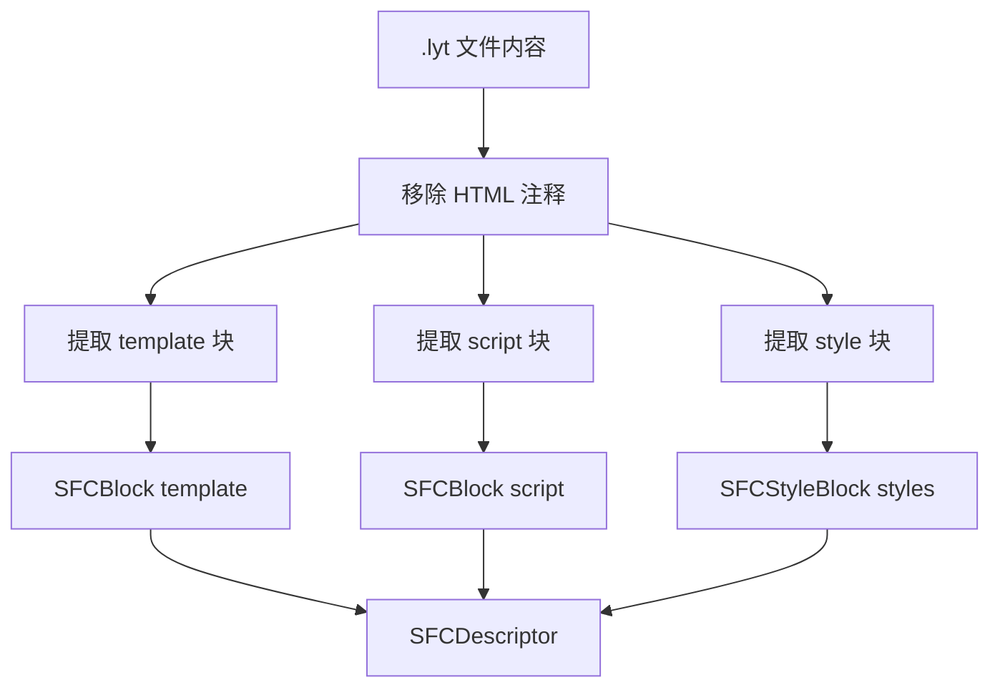

# Lyt.js 编译器设计（二）：SFC 编译篇

> 本文是 Lyt.js 编译器设计系列的第二篇。我们将深入探讨 Lyt.js 的单文件组件（SFC）编译器，了解 `.lyt` 文件是如何被解析、编译为 JS 模块的，以及 scoped CSS 和 TypeScript 类型声明是如何工作的。

## 目录

- [单文件组件（SFC）的设计哲学](#单文件组件sfc的设计哲学)
- [SFC 解析器](#sfc-解析器)
- [`<template>` 编译](#template-编译)
- [`<script setup>` 编译](#script-setup-编译)
- [`<style scoped>` 编译](#style-scoped-编译)
- [TypeScript 类型声明生成](#typescript-类型声明生成)
- [完整的编译示例](#完整的编译示例)
- [总结](#总结)
- [下一篇预告](#下一篇预告)

## 单文件组件（SFC）的设计哲学

单文件组件（Single File Component）将模板、逻辑和样式封装在一个文件中，是现代前端框架的标配特性。Lyt.js 使用 `.lyt` 扩展名：

```html
<!-- App.lyt -->
<template>
  <div class="app">
    <h1>{{ title }}</h1>
    <p>{{ description }}</p>
  </div>
</template>

<script>
export default {
  data() {
    return {
      title: 'Lyt.js',
      description: '轻写轻跑，所见即代码',
    }
  }
}
</script>

<style scoped>
.app {
  max-width: 800px;
  margin: 0 auto;
}
h1 {
  color: #42b883;
}
</style>
```

SFC 的设计哲学基于以下原则：

1. **关注点聚合**：模板、逻辑、样式在同一文件，减少文件切换，便于维护。开发者不需要在三个文件之间跳转来理解一个组件的完整行为。

2. **作用域隔离**：`scoped` 样式自动隔离，避免全局污染。每个组件的样式只作用于自身，不会影响其他组件。

3. **编译时优化**：编译器可以在编译阶段进行静态分析和优化。例如，静态子树提升、Patch Flags 标记等优化都是在编译时完成的。

4. **类型安全**：自动生成 TypeScript 类型声明，提供 IDE 智能提示和类型检查。

5. **预处理器支持**：支持 CSS 预处理器（Sass、Less）和模板预处理器（Pug）。

## SFC 解析器

Lyt.js 的 SFC 解析器（`parse-sfc.ts`）将 `.lyt` 文件内容解析为描述符对象。解析器的设计目标是正确处理各种边界情况，包括嵌套标签、注释、空行等。

### SFCDescriptor 接口

```ts
export interface SFCDescriptor {
  filename: string
  template: SFCBlock | null
  script: SFCBlock | null
  styles: SFCStyleBlock[]
}

export interface SFCBlock {
  type: 'template' | 'script' | 'style'
  content: string
  start: number
  end: number
  attrs: Record<string, string>
}

export interface SFCStyleBlock extends SFCBlock {
  type: 'style'
  scoped: boolean
}
```

### 解析流程



解析器使用正则表达式提取各块内容，支持嵌套标签匹配。解析过程分为三个步骤：

1. **预处理**：移除 HTML 注释，避免注释中的标签被误识别
2. **块提取**：使用正则表达式匹配 `<template>`、`<script>`、`<style>` 标签
3. **属性解析**：提取标签上的属性（如 `scoped`、`lang`、`setup` 等）

### 解析器实现

```ts
export function parseSFC(source: string, filename = 'anonymous.lyt'): SFCDescriptor {
  const cleaned = source.replace(COMMENT_RE, '')

  const templateBlock = extractBlock(cleaned, TEMPLATE_OPEN_RE, '</template>')
  const scriptBlock = extractBlock(cleaned, SCRIPT_OPEN_RE, '</script>')

  // 提取所有 style 块（支持多个 style 块）
  const styles: SFCStyleBlock[] = []
  let searchSource = cleaned
  while (true) {
    const styleBlock = extractBlock(searchSource, STYLE_OPEN_RE, '</style>')
    if (!styleBlock) break
    styles.push({
      type: 'style',
      content: styleBlock.content,
      start: styleBlock.start,
      end: styleBlock.end,
      attrs: styleBlock.attrs,
      scoped: 'scoped' in styleBlock.attrs,
    })
    searchSource = searchSource.slice(styleBlock.end)
  }

  return { filename, template, script, styles }
}
```

### 支持的块属性

| 属性 | 适用块 | 说明 |
|------|--------|------|
| `scoped` | style | 启用作用域样式 |
| `lang="ts"` | script | TypeScript 支持 |
| `lang="sass"` | style | Sass 预处理器 |
| `lang="pug"` | template | Pug 模板引擎 |
| `setup` | script | setup 语法糖 |

## `<template>` 编译

`<template>` 块的内容被传递给模板编译器（`compile()`）进行编译。编译过程复用了模板编译器的四阶段流程（解析、转换、优化、代码生成）：

```ts
export function compileSFC(descriptor: SFCDescriptor): SFCCompileResult {
  let renderCode = 'null'
  if (descriptor.template) {
    const compileResult = compile(descriptor.template.content)
    renderCode = `function(_ctx) { return ${compileResult.code} }`
  }
  // ...
}
```

编译后的 render 函数接收 `_ctx`（组件上下文）作为参数：

```ts
// 编译前
<template>
  <div class="app">{{ message }}</div>
</template>

// 编译后
function(_ctx) { return h('div', { 'class': 'app' }, _ctx.message) }
```

### 模板编译器的优化传递

SFC 编译器会将模板编译器的优化结果（静态提升、Patch Flags、Block Tree）一并传递给运行时：

```ts
export function compileSFC(descriptor: SFCDescriptor): SFCCompileResult {
  const compileResult = compile(descriptor.template.content)

  return {
    code: compileResult.code,
    hoisted: compileResult.hoistResult?.hoistedNodes || [],
    patchFlags: compileResult.patchFlags,
    // ...
  }
}
```

## `<script setup>` 编译

`<script>` 块的内容被提取并与 render 函数合并。Lyt.js 支持 `export default` 语法，编译器会提取组件定义并与 render 函数合并：

```ts
function extractExportDefault(scriptContent: string): string | null {
  const EXPORT_DEFAULT_RE = /export\s+default\s*\{([\s\S]*?)\}\s*$/
  const match = EXPORT_DEFAULT_RE.exec(scriptContent)
  return match ? match[1].trim() : null
}
```

### 编译产物

最终生成的 JS 模块代码包含以下部分：

1. **样式注入**：自动注入 scoped CSS
2. **render 函数**：编译后的渲染函数
3. **组件定义**：合并用户定义和 render 函数

```js
// Generated by Lyt.js SFC Compiler

const _sfcId = 'data-v-3f2a1b'

// 样式注入
const _styles = [".app[data-v-3f2a1b] { max-width: 800px; }"]
function _injectStyles() {
  for (const css of _styles) {
    const style = document.createElement("style")
    style.setAttribute("data-sfc-id", _sfcId)
    style.textContent = css
    document.head.appendChild(style)
  }
}
_injectStyles()

export default {
  __sfcId: _sfcId,
  render: function(_ctx) { return h('div', { 'class': 'app' }, _ctx.message) },
  ...{ data() { return { message: 'hello' } } },
}
```

### 组件选项合并

编译器会将用户定义的组件选项（data、methods、computed 等）与编译器生成的选项（render、__sfcId）合并：

```ts
// 用户定义
export default {
  data() { return { count: 0 } },
  methods: {
    increment() { this.count++ }
  },
  computed: {
    double() { return this.count * 2 }
  }
}

// 编译后
export default {
  __sfcId: 'data-v-3f2a1b',
  render: function(_ctx) { /* ... */ },
  data() { return { count: 0 } },
  methods: { increment() { this.count++ } },
  computed: { double() { return this.count * 2 } },
}
```

## `<style scoped>` 编译

Scoped CSS 是 SFC 的重要特性。Lyt.js 通过为每个组件生成唯一的 `scopedId`（如 `data-v-3f2a1b`），并改写 CSS 选择器来实现样式隔离。

### scopedId 生成

scopedId 基于文件名和文件内容生成，确保唯一性：

```ts
function generateScopedId(filename: string, content: string): string {
  let hash = 5381
  const seed = filename + '\x00' + content
  for (let i = 0; i < seed.length; i++) {
    hash = ((hash << 5) + hash + seed.charCodeAt(i)) & 0xffffffff
  }
  return 'data-v-' + (hash >>> 0).toString(16).slice(0, 6)
}
```

### CSS 选择器改写

`scopeCSS()` 函数使用状态机方式处理 CSS，正确处理各种边界情况：

```ts
export function scopeCSS(css: string, scopedId: string): string {
  // 状态机处理：
  // 1. 跳过 @keyframes、@font-face 等不需要改写的块
  // 2. 递归处理 @media、@supports 等包含选择器的块
  // 3. 对普通选择器添加 [data-v-xxx] 属性
}
```

改写规则：

```css
/* 改写前 */
.counter { color: red; }
.parent .child { font-size: 14px; }
.btn::before { content: ''; }
.btn:hover { opacity: 0.8; }

/* 改写后 */
.counter[data-v-3f2a1b] { color: red; }
.parent .child[data-v-3f2a1b] { font-size: 14px; }
.btn[data-v-3f2a1b]::before { content: ''; }
.btn[data-v-3f2a1b]:hover { opacity: 0.8; }
```

### scopedId 的 DOM 注入

编译器会在组件的根元素上自动添加 `scopedId` 属性：

```html
<!-- 编译前 -->
<template>
  <div class="counter">{{ count }}</div>
</template>

<!-- 编译后（运行时） -->
<div class="counter" data-v-3f2a1b>0</div>
```

### 状态机处理 CSS 的优势

使用状态机而非简单的正则替换来处理 CSS，可以正确处理以下边界情况：

1. **@规则跳过**：`@keyframes`、`@font-face` 等不需要改写
2. **嵌套规则**：`@media` 内的选择器需要递归改写
3. **伪元素**：`::before`、`::after` 的 scopedId 位置正确
4. **多选择器**：`.a, .b { }` 两个选择器都需要改写
5. **注释**：CSS 注释中的内容不应被改写

## TypeScript 类型声明生成

Lyt.js 的 SFC 编译器可以为 `.lyt` 文件生成 TypeScript 类型声明（`.d.ts`），提供 IDE 智能提示和类型检查：

```ts
export function generateTypeDeclarations(sfc: SFCDescriptor, options: TypeGenerateOptions = {}): string {
  const { filename = 'Component' } = options
  const componentName = filename.replace(/\.lyt$/, '')

  return `
/** ${componentName} 组件类型声明 */
export interface ComponentProps {
  [key: string]: any;
}

export interface ComponentEmits {
  [key: string]: (...args: any[]) => any;
}

declare const component: import('@lytjs/component').ComponentDefine;
export default component;
`
}
```

### Vite 插件集成

通过 Vite 插件在构建时自动生成类型声明：

```ts
import { defineConfig } from 'vite'
import lyt from '@lytjs/compiler'

export default {
  plugins: [
    lyt({
      typescript: {
        generateDeclarations: true,  // 自动生成 .d.ts
        declarationDir: 'types',      // 输出目录
      },
    }),
  ],
}
```

### 类型声明的内容

生成的类型声明包含：

1. **组件 Props 类型**：从 `defineProps` 提取
2. **组件 Emits 类型**：从 `defineEmits` 提取
3. **组件实例类型**：包含 data、methods、computed 的类型
4. **Slots 类型**：从模板中的 `<slot>` 提取

## 完整的编译示例

### 输入

```html
<!-- Counter.lyt -->
<template>
  <div class="counter">
    <h2>Counter: {{ count }}</h2>
    <p>Double: {{ double }}</p>
    <button @click="increment">+1</button>
    <button @click="decrement">-1</button>
  </div>
</template>

<script>
export default {
  data() {
    return { count: 0 }
  },
  computed: {
    double() { return this.count * 2 }
  },
  methods: {
    increment() { this.count++ },
    decrement() { this.count-- },
  },
}
</script>

<style scoped>
.counter {
  padding: 20px;
  border: 1px solid #ddd;
  border-radius: 8px;
}
.counter h2 {
  color: #42b883;
}
button {
  margin: 0 4px;
  padding: 4px 12px;
}
</style>
```

### 输出

```js
// Generated by Lyt.js SFC Compiler

const _sfcId = 'data-v-a1b2c3'

// Scoped CSS
const _styles = [".counter[data-v-a1b2c3]{padding:20px;border:1px solid #ddd;border-radius:8px}.counter h2[data-v-a1b2c3]{color:#42b883}button[data-v-a1b2c3]{margin:0 4px;padding:4px 12px}"]
function _injectStyles(){for(const css of _styles){const s=document.createElement("style");s.setAttribute("data-sfc-id",_sfcId);s.textContent=css;document.head.appendChild(s)}}
_injectStyles()

// Render function
function render(_ctx) {
  return h('div', { 'class': 'counter' }, [
    h('h2', null, 'Counter: ' + _ctx.count),
    h('p', null, 'Double: ' + _ctx.double),
    h('button', { 'onClick': _ctx.increment }, '+1'),
    h('button', { 'onClick': _ctx.decrement }, '-1'),
  ])
}

// Component definition
export default {
  __sfcId: _sfcId,
  render,
  data() { return { count: 0 } },
  computed: { double() { return this.count * 2 } },
  methods: {
    increment() { this.count++ },
    decrement() { this.count-- },
  },
}
```

## 总结

Lyt.js 的 SFC 编译器提供了完整的单文件组件开发体验：

1. **SFC 解析器**：正则表达式 + 嵌套匹配，正确提取 template/script/style 块
2. **template 编译**：复用模板编译器的四阶段流程，传递优化结果
3. **script 编译**：提取 `export default` 内容，与 render 函数合并
4. **scoped CSS**：基于 scopedId 的选择器改写，状态机处理各种边界情况
5. **类型声明**：自动生成 `.d.ts`，提供完整的 IDE 类型提示

## 下一篇预告

在下一系列中，我们将探讨 Lyt.js 的 Vapor Mode -- 一种无虚拟 DOM 的渲染方案。我们将了解它如何通过 Signal 直接操作 DOM 来实现极致性能，以及它与 VDOM 模式的性能对比。
