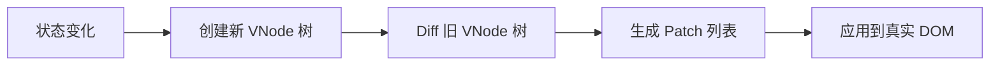
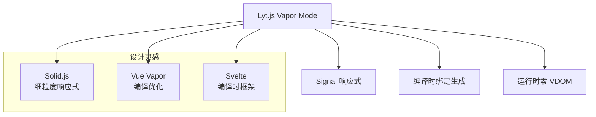
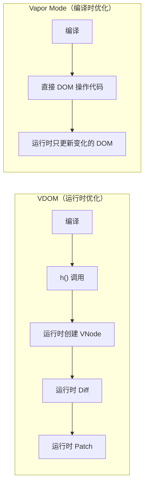
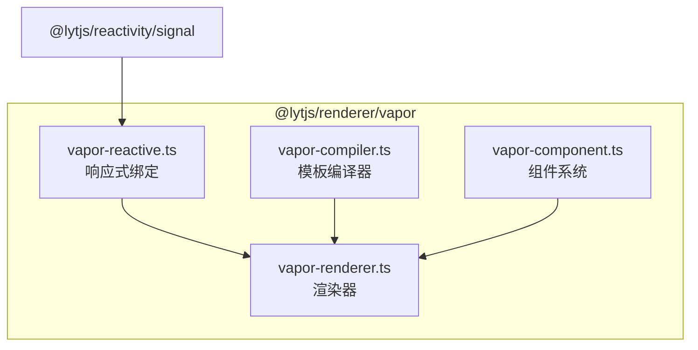
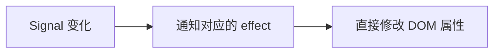
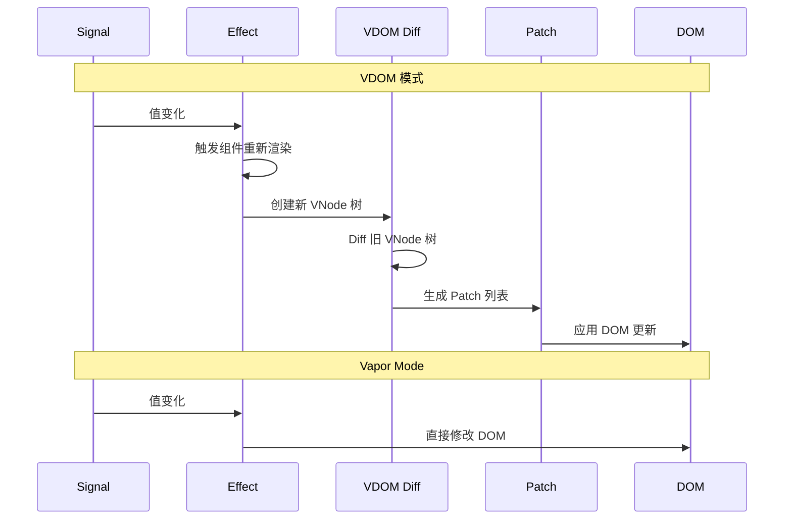

# Vapor Mode：无 VDOM 的渲染（一）：设计理念

> 本文是 Lyt.js Vapor Mode 系列的第一篇。我们将探讨虚拟 DOM 的性能瓶颈，以及 Lyt.js 如何通过 Vapor Mode 实现无 VDOM 的直接 DOM 操作渲染，深入分析其设计理念和架构。

## 目录

- [虚拟 DOM 的性能瓶颈](#虚拟-dom-的性能瓶颈)
- [Vapor Mode 的设计灵感](#vapor-mode-的设计灵感)
- [编译时优化 vs 运行时优化](#编译时优化-vs-运行时优化)
- [Lyt.js Vapor Mode 的架构](#lytjs-vapor-mode-的架构)
- [直接 DOM 操作 vs VDOM diff](#直接-dom-操作-vs-vdom-diff)
- [Vapor Mode 的组件模型](#vapor-mode-的组件模型)
- [总结](#总结)
- [下一篇预告](#下一篇预告)

## 虚拟 DOM 的性能瓶颈

虚拟 DOM 是现代前端框架的基石，它通过在内存中维护一棵虚拟节点树来最小化真实 DOM 操作。这个方案在大多数场景下工作良好，但随着应用规模的增长，它的性能瓶颈逐渐显现。

### VDOM 的工作流程



每一步都有开销：

1. **创建 VNode 树**：每次状态变化都要创建新的 VNode 对象，即使大部分节点没有变化。一个包含 100 个节点的组件，每次更新都要创建 100 个 VNode 对象。

2. **Diff 算法**：O(n) 时间复杂度的树比对，即使大部分节点没变化也要遍历整棵树。虽然 Block Tree 优化可以跳过静态子树，但动态子节点仍然需要逐一比对。

3. **Patch 应用**：将 diff 结果应用到真实 DOM。虽然 diff 算法已经最小化了 DOM 操作，但 patch 过程本身也有开销。

### VDOM 的隐藏成本

```ts
// 一个简单的计数器组件
function Counter() {
  const [count, setCount] = useState(0)
  return h('div', null, [
    h('span', null, 'Count: '),      // 静态节点
    h('span', null, String(count)),   // 动态节点
    h('button', { onClick: () => setCount(c => c + 1) }, '+'),  // 静态节点
  ])
}
```

当 `count` 变化时，VDOM 需要：

1. 重新创建整个组件的 VNode 树（3 个子节点）
2. Diff 比对 3 个子节点
3. 发现只有第 2 个 `span` 的文本变化
4. 只更新第 2 个 `span` 的 textContent

**实际只更新了 1 个 DOM 节点，但 VDOM 创建和比对了 3 个节点。** 在更复杂的组件中，这个比例可能更悬殊。

### VDOM 的内存开销

每个 VNode 对象包含 type、props、children、key 等属性。在大型应用中，VDOM 树会占用大量内存：

```ts
// 一个 VNode 对象的典型结构
const vnode = {
  type: 'div',
  tag: 'div',
  props: { class: 'container', id: 'app' },
  children: [/* ... */],
  key: null,
  patchFlag: 0,
  dynamicChildren: [],
  // ... 更多属性
}
// 估算：每个 VNode 约 200-500 字节
```

一个包含 1000 个节点的应用，VDOM 树约占 200KB-500KB 内存。每次更新时，还会创建新的 VNode 对象，增加 GC 压力。

### VDOM 的适用性分析

VDOM 并非在所有场景下都是最优解：

| 场景 | VDOM 表现 | 原因 |
|------|----------|------|
| 复杂组件树 | 良好 | diff 算法有效减少 DOM 操作 |
| 高频更新（60fps） | 一般 | VNode 创建和 diff 有延迟 |
| 大列表（10000+） | 较差 | diff 开销随节点数线性增长 |
| 简单组件 | 过度 | 简单组件不需要 diff |
| 内存受限环境 | 较差 | VNode 树占用额外内存 |

## Vapor Mode 的设计灵感

Vapor Mode 的设计灵感来自多个项目和社区探索：

- **Solid.js**（2021）：率先提出了"无 VDOM"的响应式 UI 方案，使用细粒度响应式 + 编译时优化，证明了不使用 VDOM 也能构建高性能的响应式 UI。

- **Vue Vapor**（实验性）：Vue 3 的实验性编译模式，尝试在编译时生成直接 DOM 操作代码，减少运行时开销。

- **Svelte**（2016）：编译时框架的先驱，将响应式声明编译为命令式 DOM 操作，运行时几乎为零。

- **Framer Motion**：在动画领域证明了直接 DOM 操作的性能优势。

Lyt.js 的 Vapor Mode 结合了这些项目的优点：



## 编译时优化 vs 运行时优化

VDOM 是一种**运行时优化**策略：在运行时通过 diff 算法最小化 DOM 操作。框架在编译时只生成 `h()` 调用，所有的优化都在运行时完成。

Vapor Mode 是一种**编译时优化**策略：在编译时就确定每个响应式值对应哪个 DOM 节点，生成精确的 DOM 操作代码。运行时不需要 diff，只需要在值变化时更新对应的 DOM。



### 对比示例

```html
<!-- 模板 -->
<div>
  <span>{{ message }}</span>
  <p>{{ count }}</p>
</div>
```

**VDOM 模式生成的代码：**

```js
function render(_ctx) {
  return h('div', null, [
    h('span', null, _ctx.message),
    h('p', null, _ctx.count),
  ])
}
// 每次更新：创建新 VNode → Diff → Patch
// 即使只有 message 变化，也要创建和比对整个 VNode 树
```

**Vapor Mode 生成的代码：**

```js
// 初始化时直接创建 DOM
const div = document.createElement('div')
const span = document.createElement('span')
const p = document.createElement('p')
div.appendChild(span)
div.appendChild(p)

// 响应式绑定：只更新变化的 DOM
effect(() => { span.textContent = message() })
effect(() => { p.textContent = String(count()) })
// 更新时：直接修改对应的 DOM 属性，无中间步骤
```

### 编译时优化的优势

1. **精确更新**：每个 Signal 直接对应一个 DOM 操作，没有多余的创建和比对
2. **零运行时框架**：不需要 VDOM diff 算法，运行时代码更少
3. **可预测的性能**：性能不随组件复杂度线性增长
4. **更少的内存**：不需要维护 VNode 树

## Lyt.js Vapor Mode 的架构

Lyt.js Vapor Mode 由四个核心模块组成，每个模块职责清晰：



### vapor-reactive.ts -- 响应式绑定

提供将 Signal 直接绑定到 DOM 的函数，这是 Vapor Mode 的核心能力：

```ts
// 文本绑定
bindText(el, signal)           // signal → el.textContent
// 属性绑定
bindProp(el, prop, signal)     // signal → el[prop]
// HTML 属性绑定
bindAttr(el, attr, signal)     // signal → el.setAttribute
// Class 绑定
bindClass(el, signal)          // signal → el.className
// 样式绑定
bindStyle(el, signal)          // signal → el.style
// 事件绑定
bindEvent(el, event, handler)  // el.addEventListener
// 条件渲染
bindIf(el, signal)             // signal → 插入/移除 DOM
// 列表渲染
bindEach(container, signal, renderItem)  // signal → 列表 diff
```

每个绑定函数返回一个清理函数，用于在卸载时取消订阅。这种设计确保了不会有内存泄漏。

### vapor-renderer.ts -- 渲染器

提供 Vapor 元素创建和渲染功能：

```ts
// 创建 Vapor 元素
createVaporElement(tag, props, ...children): VaporNode

// 渲染 VaporNode 为真实 DOM
renderVaporNode(node: VaporNode): VaporElement

// Vapor Patch（直接 DOM 更新）
vaporPatch(oldNode, newNode, parentEl): void

// 挂载组件
vaporMount(container, component): () => void
```

### vapor-compiler.ts -- 模板编译器

将 HTML 模板编译为直接 DOM 操作的渲染函数。这是 Vapor Mode 与 VDOM 模式的关键区别 -- 编译器生成的是 DOM API 调用，而不是 `h()` 函数调用：

```ts
export function compileToVapor(template: string): VaporCompileResult {
  const ast = parseTemplate(template)
  const render = generateRenderFunction(ast)
  return { render, ast }
}
```

### vapor-component.ts -- 组件系统

提供 Vapor 组件定义和 App 创建：

```ts
// 定义 Vapor 组件
defineVaporComponent(options: VaporComponentOptions)

// 创建 Vapor App
createVaporApp(rootComponent: VaporComponentOptions): VaporApp
```

## 直接 DOM 操作 vs VDOM diff

### Vapor Mode 的工作流程



没有 VNode 创建，没有 diff 算法，没有 patch 列表。Signal 变化直接触发对应的 DOM 操作。这就是 Vapor Mode 的核心优势 -- **消除所有中间层**。

### VaporNode 结构

VaporNode 是 Vapor Mode 的核心数据结构，代表一个直接的 DOM 绑定关系：

```ts
export interface VaporNode {
  tag: string
  el?: VaporElement
  children: VaporNode[]
  props: Record<string, unknown>
  events: Record<string, Function>
  bindings: VaporBinding<unknown>[]  // 响应式绑定列表
  text?: string
  key?: string | number
  _bindingCleanups?: BindingCleanup[]
}
```

与 VNode 的关键区别：

| 特性 | VNode | VaporNode |
|------|-------|-----------|
| 用途 | 描述 UI 结构 | 描述 DOM 绑定关系 |
| 创建时机 | 每次渲染 | 仅首次渲染 |
| 更新方式 | Diff + Patch | 直接修改 DOM |
| 内存 | 每次更新创建新对象 | 复用同一对象 |
| children | VNode 数组 | VaporNode 数组 |
| bindings | 无 | Signal 绑定列表 |

### 更新路径对比



## Vapor Mode 的组件模型

Vapor Mode 的组件模型与 VDOM 模式类似，但内部实现完全不同：

```ts
import { signal, createVaporApp, defineVaporComponent } from '@lytjs/renderer'

const count = signal(0)
const message = signal('Hello Vapor!')

const app = createVaporApp(defineVaporComponent({
  setup() {
    return { count, message }
  },
  render(ctx, h) {
    return h('div', { className: 'app' },
      h('h1', { textContent: ctx.message }),
      h('p', { textContent: ctx.count }),
      h('button', {
        onClick: () => ctx.count.set(ctx.count() + 1),
      }, 'Increment'),
    )
  },
}))

app.mount('#app')
```

### Vapor 组件 vs VDOM 组件

| 特性 | VDOM 组件 | Vapor 组件 |
|------|----------|-----------|
| 渲染函数 | 返回 VNode | 返回 VaporNode |
| 状态管理 | reactive/ref | signal |
| 更新机制 | 重新渲染 + diff | Signal 绑定 |
| 生命周期 | onMounted 等 | onSignalCleanup |
| Props | Proxy reactive | Signal |
| Slots | VNode children | VaporNode children |

### Vapor 组件的生命周期

Vapor 组件使用 `onSignalCleanup` 替代传统的 `onUnmounted`：

```ts
defineVaporComponent({
  setup() {
    const timer = setInterval(() => {
      console.log('tick')
    }, 1000)

    // 组件卸载时自动清理
    onSignalCleanup(() => {
      clearInterval(timer)
    })

    return {}
  },
  render() { /* ... */ },
})
```

## 总结

Vapor Mode 代表了前端渲染的未来方向：

1. **消除 VDOM 开销**：不创建 VNode，不运行 diff 算法，Signal 变化直接触发 DOM 更新
2. **细粒度更新**：每个 Signal 直接对应一个 DOM 操作，更新精度达到 DOM 节点级别
3. **编译时优化**：编译器生成最优的 DOM 操作代码，运行时零框架开销
4. **更低的内存占用**：不需要维护 VNode 树，内存占用显著降低
5. **可预测的性能**：性能不随组件复杂度线性增长，适合高性能场景

Vapor Mode 并非要完全替代 VDOM 模式。它为性能敏感的场景提供了一个选择，开发者可以根据具体需求选择最合适的渲染模式。

## 下一篇预告

在下一篇中，我们将深入 Vapor Mode 的性能优化细节，包括绑定系统的实现、内存管理机制、性能对比数据和适用场景分析。
