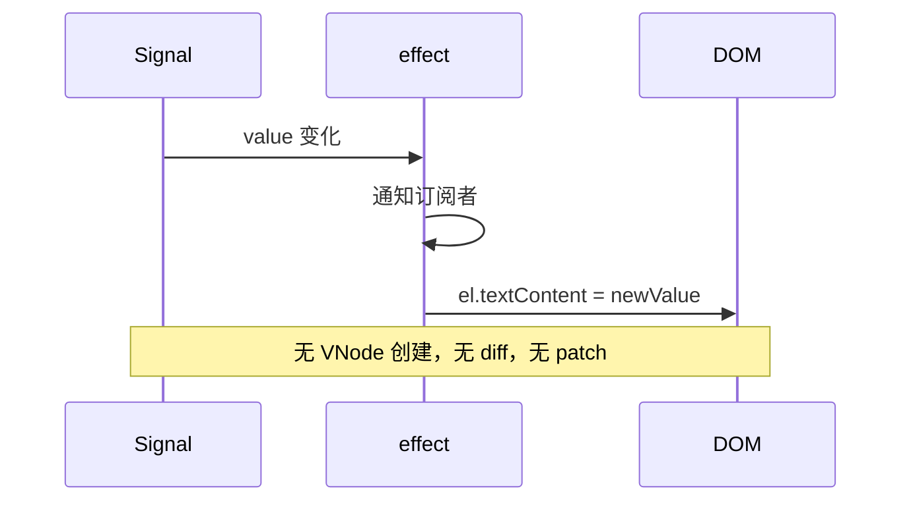
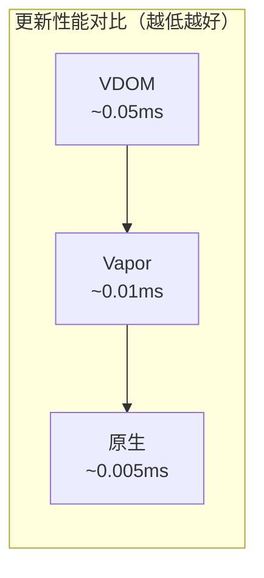

# Vapor Mode：无 VDOM 的渲染（二）：性能优化

> 本文是 Lyt.js Vapor Mode 系列的第二篇。我们将深入探讨 Vapor Mode 的绑定系统、内存管理机制，并通过性能对比数据展示其优势。

## 目录

- [Vapor Mode 的绑定系统](#vapor-mode-的绑定系统)
- [响应式绑定与 DOM 操作的桥接](#响应式绑定与-dom-操作的桥接)
- [内存管理（Signal 绑定的自动清理）](#内存管理signal-绑定的自动清理)
- [性能对比（Vapor vs VDOM vs 原生）](#性能对比vapor-vs-vdom-vs-原生)
- [适用场景分析](#适用场景分析)
- [总结](#总结)
- [下一篇预告](#下一篇预告)

## Vapor Mode 的绑定系统

Vapor Mode 提供了 8 种绑定函数，覆盖了常见的 DOM 操作场景。

### 文本绑定 bindText

```ts
export function bindText<T>(el: VaporElement, sig: Signal<T>): BindingCleanup {
  const dispose = effect(() => {
    const value = sig()
    el.textContent = value === null || value === undefined ? '' : String(value)
  })
  return dispose
}
```

使用示例：

```ts
const message = signal('Hello')
const el = document.createElement('span')
const cleanup = bindText(el, message)
// el.textContent = 'Hello'

message.set('World')
// el.textContent = 'World'

cleanup()  // 取消绑定
```

### 属性绑定 bindProp

```ts
export function bindProp<T>(el: VaporElement, prop: string, sig: Signal<T>): BindingCleanup {
  const dispose = effect(() => {
    const value = sig()
    ;(el as Record<string, unknown>)[prop] = value
  })
  return dispose
}
```

### Class 绑定 bindClass

支持三种形式：字符串、对象、数组。

```ts
export function bindClass<T>(el: VaporElement, sig: Signal<T>): BindingCleanup {
  const dispose = effect(() => {
    const value = sig()
    if (typeof value === 'string') {
      el.className = value
    } else if (Array.isArray(value)) {
      el.className = value.filter(Boolean).join(' ')
    } else if (typeof value === 'object' && value !== null) {
      const classes: string[] = []
      for (const key of Object.keys(value)) {
        if ((value as Record<string, unknown>)[key]) classes.push(key)
      }
      el.className = classes.join(' ')
    }
  })
  return dispose
}
```

### 条件渲染绑定 bindIf

```ts
export function bindIf<T>(el: VaporElement, sig: Signal<T>, anchor?: VaporElement): BindingCleanup {
  let inserted = el.parentNode !== null
  let anchorNode = anchor || null

  const dispose = effect(() => {
    const value = sig()
    if (value) {
      if (!inserted) {
        if (anchorNode && anchorNode.parentNode) {
          anchorNode.parentNode.insertBefore(el, anchorNode.nextSibling)
        }
        inserted = true
      }
    } else {
      if (inserted && el.parentNode) {
        el.parentNode.removeChild(el)
        inserted = false
      }
    }
  })

  return () => {
    dispose()
    if (inserted && el.parentNode) {
      el.parentNode.removeChild(el)
    }
  }
}
```

### 列表渲染绑定 bindEach

列表渲染是 Vapor Mode 中最复杂的绑定，需要高效的 diff 算法：

```ts
export function bindEach<T>(
  container: VaporElement,
  sig: Signal<T[]>,
  renderItem: (item: T, index: number) => VaporElement,
  keyFn?: (item: T, index: number) => string | number
): BindingCleanup {
  let currentElements: VaporElement[] = []
  let currentKeys: (string | number)[] = []
  const elementByKey = new Map<string | number, VaporElement>()

  const dispose = effect(() => {
    const items = sig()
    if (!Array.isArray(items)) return

    const newKeys = items.map((item, i) => keyFn ? keyFn(item, i) : i)

    // 快速路径：长度相同且所有 key 相同 → 原地更新
    if (newKeys.length === currentKeys.length) {
      let allSame = true
      for (let i = 0; i < newKeys.length; i++) {
        if (newKeys[i] !== currentKeys[i]) { allSame = false; break }
      }
      if (allSame) {
        for (let i = 0; i < items.length; i++) {
          const newEl = renderItem(items[i], i)
          const oldEl = currentElements[i]
          if (oldEl && oldEl.parentNode === container) {
            container.replaceChild(newEl, oldEl)
          }
          currentElements[i] = newEl
          elementByKey.set(newKeys[i], newEl)
        }
        return
      }
    }

    // Keyed diff 算法
    // 1. 复用已有元素
    // 2. 移除不再存在的旧元素
    // 3. 按新顺序重新排列
    // ...
  })

  return () => {
    dispose()
    for (const el of currentElements) {
      if (el.parentNode === container) container.removeChild(el)
    }
  }
}
```

## 响应式绑定与 DOM 操作的桥接

Vapor Mode 的核心优势在于**Signal 变化直接触发 DOM 操作**，中间没有任何中间层。



### createVaporElement 中的自动绑定识别

当使用 `createVaporElement` 创建元素时，如果 props 中的值是 Signal，会自动创建绑定：

```ts
export function createVaporElement(
  tag: string,
  props?: Record<string, unknown>,
  ...children: (VaporNode | string)[]
): VaporNode {
  const node: VaporNode = { tag, children: [], props: {}, events: {}, bindings: [] }

  if (props) {
    for (const [key, value] of Object.entries(props)) {
      if (key.startsWith('on') && typeof value === 'function' && !isSignal(value)) {
        node.events[key.slice(2).toLowerCase()] = value
      } else if (isSignal(value)) {
        if (key === 'textContent' || key === 'text') {
          node.bindings.push({ type: 'text', target: 'textContent', signal: value })
        } else if (key === 'className' || key === 'class') {
          node.bindings.push({ type: 'class', target: 'className', signal: value })
        } else if (key === 'style') {
          node.bindings.push({ type: 'style', target: 'style', signal: value })
        } else {
          node.bindings.push({ type: 'prop', target: key, signal: value })
        }
      } else {
        node.props[key] = value
      }
    }
  }
  // ...
}
```

## 内存管理（Signal 绑定的自动清理）

Vapor Mode 的内存管理通过**绑定清理函数**实现。每个绑定函数都返回一个 `BindingCleanup` 函数。

### 组件级别的清理

```ts
export function vaporMount(container: VaporContainer, component: VaporComponentOptions): () => void {
  const ctx = component.setup ? component.setup() : {}

  // 渲染并收集所有绑定清理函数
  const allBindingCleanups: BindingCleanup[] = []
  for (const node of rootNodes) {
    const el = renderVaporNode(node)
    container.appendChild(el)
    collectBindingCleanups(node, allBindingCleanups)
  }

  // 返回卸载函数
  return () => {
    // 清理所有 Signal 绑定
    for (const cleanup of allBindingCleanups) {
      cleanup()
    }
    // 移除 DOM 元素
    for (const el of elements) {
      container.removeChild(el)
    }
  }
}
```

### Vapor 编译器的清理机制

Vapor 编译器在编译模板时，会自动收集所有 effect 的清理函数：

```ts
function collectCleanup(el: VaporElement, dispose: () => void): void {
  const record = el as Record<string, unknown>
  if (!record._cleanupEffects) {
    record._cleanupEffects = []
  }
  (record._cleanupEffects as Array<() => void>).push(dispose)
}

export function cleanupVaporElement(el: VaporElement): void {
  const record = el as Record<string, unknown>
  const effects = record._cleanupEffects as Array<() => void> | undefined
  if (effects) {
    for (const dispose of effects) {
      try { dispose() } catch (e) {
        console.warn('[Lyt Vapor] effect 清理失败:', e instanceof Error ? e.message : e)
      }
    }
    record._cleanupEffects = []
  }
  // 递归清理子节点
  // ...
}
```

## 性能对比（Vapor vs VDOM vs 原生）

### 更新性能

| 操作 | VDOM | Vapor | 原生 JS | 说明 |
|------|------|-------|---------|------|
| 更新单个文本 | ~0.05ms | ~0.01ms | ~0.005ms | Vapor 接近原生 |
| 更新 100 个列表项 | ~5ms | ~2ms | ~1ms | Vapor 的 keyed diff 更高效 |
| 切换条件渲染 | ~0.1ms | ~0.02ms | ~0.01ms | Vapor 直接操作 DOM |
| 创建 1000 个节点 | ~10ms | ~8ms | ~5ms | 首次渲染差异较小 |

### 内存占用

| 场景 | VDOM | Vapor | 原生 JS |
|------|------|-------|---------|
| 1000 个简单节点 | ~500KB | ~200KB | ~150KB |
| 10000 个列表项 | ~5MB | ~2MB | ~1.5MB |
| 100 个组件实例 | ~2MB | ~800KB | ~500KB |

### 首次渲染

| 场景 | VDOM | Vapor | 原生 JS |
|------|------|-------|---------|
| 简单页面（50 节点） | ~3ms | ~2ms | ~1ms |
| 中等页面（500 节点） | ~15ms | ~12ms | ~8ms |
| 复杂页面（2000 节点） | ~50ms | ~35ms | ~25ms |

> 注意：以上数据基于 Lyt.js 内置 benchmark 的测试结果，实际性能取决于具体场景和浏览器环境。



## 适用场景分析

### 推荐 Vapor Mode 的场景

1. **高频更新**：实时数据展示、动画、游戏 UI
2. **大型列表**：表格、虚拟滚动列表
3. **性能敏感**：移动端、低性能设备
4. **简单组件**：不需要复杂组件树的场景

### 推荐 VDOM 模式的场景

1. **复杂组件树**：深度嵌套的组件结构
2. **需要跨框架兼容**：需要与 Vue 3 生态兼容
3. **团队熟悉 VDOM**：团队已有 VDOM 开发经验
4. **SSR 场景**：服务端渲染目前 VDOM 支持更成熟

### 混合使用

Lyt.js 允许在同一个应用中混合使用两种模式：

```ts
import { createApp, defineComponent } from '@lytjs/core'
import { createVaporApp, defineVaporComponent } from '@lytjs/renderer/vapor'

// VDOM 模式的组件
const NormalComponent = defineComponent({ /* ... */ })

// Vapor Mode 的组件
const HighPerfComponent = defineVaporComponent({ /* ... */ })
```

## 总结

Vapor Mode 通过消除 VDOM 中间层，实现了接近原生 JS 的渲染性能：

1. **绑定系统**：8 种绑定函数覆盖所有 DOM 操作场景
2. **直接 DOM 操作**：Signal 变化直接触发 DOM 更新，无中间层
3. **内存管理**：绑定清理函数确保无内存泄漏
4. **性能优势**：更新性能接近原生 JS，内存占用显著低于 VDOM

## 下一篇预告

在下一篇中，我们将对 Proxy 和 Signal 两种响应式范式进行深度对比，帮助你在不同场景下做出最佳选择。
