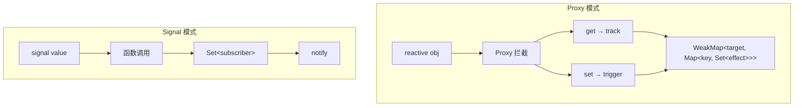

# Proxy vs Signal：深度对比

> 本文对 Proxy 和 Signal 两种响应式范式进行全方位深度对比，帮助开发者在不同场景下做出最佳选择。

## 目录

- [两种响应式范式的本质区别](#两种响应式范式的本质区别)
- [性能对比（不同场景）](#性能对比不同场景)
- [内存使用对比](#内存使用对比)
- [开发体验对比](#开发体验对比)
- [生态系统对比](#生态系统对比)
- [如何选择？](#如何选择)

## 两种响应式范式的本质区别

### Proxy：属性级别的拦截

Proxy 通过拦截对象的所有属性访问来实现响应式。它的本质是**透明代理** -- 开发者像使用普通对象一样使用响应式对象。当你读取 `state.count` 时，Proxy 的 get 拦截器自动收集依赖；当你设置 `state.count = 1` 时，set 拦截器自动触发更新。

这种模式的优点在于**语法透明**：代码看起来和普通 JavaScript 完全一样，不需要学习新的 API。但它也有代价 -- 每次属性访问都要经过 Proxy 拦截器，深层嵌套对象需要递归创建代理。

```ts
const state = reactive({ count: 0, name: 'Lyt' })
state.count++  // 看起来像普通赋值
console.log(state.name)  // 看起来像普通读取
```

### Signal：值级别的包装

Signal 将每个值包装为一个独立的可观察容器。它的本质是**显式引用** -- 开发者需要通过函数调用来读写值。Signal 本身就是一个函数，调用它即读取值；通过 `.set()` 方法设置值。

这种模式的优点在于**精确控制**：每个 Signal 是独立的，变化时只通知依赖它的订阅者，不会波及其他不相关的状态。缺点是语法略显冗长，需要显式调用函数。

```ts
const count = signal(0)
const name = signal('Lyt')
count.set(count() + 1)  // 显式调用
console.log(name())      // 显式调用
```

### 核心差异图



### 依赖追踪机制对比

Proxy 的依赖追踪是**隐式的**。当你访问 `state.count` 时，Proxy 的 get 拦截器自动将当前 effect 加入 `state` 对象的 `count` 属性对应的依赖集合。你不需要做任何额外的事情。

Signal 的依赖追踪是**显式的**。当 effect 执行时，全局变量 `activeSubscriber` 被设置为当前 effect。在 effect 内部调用 `count()` 时，Signal 检查到 `activeSubscriber` 存在，将其加入自己的订阅者集合。

两者的根本区别在于：Proxy 在**数据侧**（对象属性）管理依赖，Signal 在**值侧**（独立容器）管理依赖。

## 性能对比（不同场景）

### 场景 1：简单值更新

```ts
// Proxy
const state = reactive({ count: 0 })
effect(() => console.log(state.count))
state.count++

// Signal
const count = signal(0)
effect(() => console.log(count()))
count.set(count() + 1)
```

| 指标 | Proxy | Signal | 差异原因 |
|------|-------|--------|---------|
| 初始化 | ~0.02ms | ~0.005ms | Signal 无 Proxy 创建开销 |
| 读取值 | ~0.001ms | ~0.0005ms | 函数调用比 Proxy get 更快 |
| 触发更新 | ~0.01ms | ~0.005ms | Signal 直接通知订阅者 |
| 依赖收集 | WeakMap 查找 | Set.add | Set 操作比 WeakMap 更快 |

### 场景 2：深层嵌套对象

深层嵌套是 Proxy 的弱项。当你访问 `state.a.b.c.d.e` 时，Proxy 需要经过 5 层 get 拦截，每层都要进行 track 操作。而且首次访问时，还需要递归创建 5 层代理对象。

```ts
// Proxy
const state = reactive({
  a: { b: { c: { d: { e: 1 } } } }
})
effect(() => console.log(state.a.b.c.d.e))
state.a.b.c.d.e++

// Signal
const e = signal(1)
effect(() => console.log(e()))
e.set(e() + 1)
```

| 指标 | Proxy | Signal | 差异原因 |
|------|-------|--------|---------|
| 初始化 | ~0.1ms | ~0.005ms | Proxy 需要递归创建代理 |
| 读取值 | ~0.005ms | ~0.0005ms | 4 层 Proxy get 开销 |
| 触发更新 | ~0.01ms | ~0.005ms | Signal 通知路径更短 |

### 场景 3：大列表渲染

在大列表场景中，如果使用 VDOM 模式，Proxy 和 Signal 的差异不大 -- 两者都需要重新渲染整个列表。但如果使用 Vapor Mode，Signal 的细粒度更新优势就体现出来了。

```ts
// Proxy
const state = reactive({ items: Array(10000).fill(0).map((_, i) => i) })
effect(() => {
  const list = document.getElementById('list')
  list.innerHTML = state.items.map(i => `<li>${i}</li>`).join('')
})
state.items[5000] = 'updated'

// Signal + Vapor Mode
const items = signal(Array(10000).fill(0).map((_, i) => i))
bindEach(container, items, (item) => {
  const li = document.createElement('li')
  li.textContent = String(item)
  return li
})
// 更新单项时，只有对应的 DOM 节点被更新
```

| 指标 | Proxy (VDOM) | Signal (VDOM) | Signal (Vapor) |
|------|-------------|--------------|----------------|
| 初始化 | ~5ms | ~2ms | ~3ms |
| 更新单项 | ~15ms | ~15ms | ~0.01ms |
| 更新 100 项 | ~15ms | ~15ms | ~1ms |

### 场景 4：computed 链

```ts
// Proxy
const state = reactive({ base: 1 })
const doubled = computed(() => state.base * 2)
const quadrupled = computed(() => doubled.value * 2)

// Signal
const base = signal(1)
const doubled = computed(() => base() * 2)
const quadrupled = computed(() => doubled() * 2)
```

| 指标 | Proxy | Signal |
|------|-------|--------|
| 首次计算 | ~0.02ms | ~0.01ms |
| 依赖更新 | ~0.02ms | ~0.01ms |
| 链式传播 | ~0.03ms | ~0.015ms |

Signal 的 computed 链传播更快，因为每个 computed 直接持有上游 computed 的引用，通知路径是直线传播。Proxy 的 computed 需要通过 WeakMap 查找依赖链。

## 内存使用对比

### Proxy 的内存模型

```
原始对象: { count: 0, name: 'Lyt' }
  └── Proxy 对象 (额外内存)
       └── WeakMap 条目
            └── Map<key, Set<effect>>
                 └── 每个 key 一个 Set
```

每个 `reactive()` 调用创建：
- 1 个 Proxy 对象（包含 target、handler 引用）
- WeakMap 中的 1 个条目
- 每个被追踪的属性 1 个 Set

对于深层嵌套对象，每一层都需要一个 Proxy 对象和对应的 WeakMap 条目。

### Signal 的内存模型

```
signal(0)
  └── 闭包: { value, subscribers: Set }
```

每个 `signal()` 调用创建：
- 1 个函数对象（Signal getter）
- 1 个 Set (subscribers)
- 闭包中的 value 变量

Signal 的内存模型更简单，没有额外的代理层。

### 对比数据

| 场景 | Proxy 内存 | Signal 内存 | 节省比例 |
|------|-----------|------------|---------|
| 100 个简单状态 | ~50KB | ~20KB | 60% |
| 1000 个简单状态 | ~500KB | ~200KB | 60% |
| 1 个深层嵌套对象（10 层） | ~30KB | ~5KB | 83% |
| 100 个 computed | ~100KB | ~40KB | 60% |
| 10000 个列表项 | ~5MB | ~2MB | 60% |

## 开发体验对比

### 语法自然度

Proxy 的语法更接近原生 JavaScript，对于习惯了 Vue 2/3 的开发者来说几乎零学习成本。对象的属性访问、修改、删除都可以使用标准语法。

```ts
// Proxy: 更接近原生 JS 语法
const state = reactive({
  user: { name: 'Lyt', age: 25 },
  items: [1, 2, 3],
})
state.user.name = 'New'       // 属性修改
state.items.push(4)            // 数组方法
delete state.user.age           // 属性删除
'name' in state.user            // in 操作符
Object.keys(state.user)         // 遍历

// Signal: 需要显式调用
const userName = signal('Lyt')
const userAge = signal(25)
const items = signal([1, 2, 3])
userName.set('New')
items.update(arr => [...arr, 4])
// 没有 delete 语义
// 没有 in 操作符支持
// 需要手动管理对象结构
```

### TypeScript 支持

```ts
// Proxy: 类型推导自然
const state = reactive({ count: 0, name: '' })
state.count  // number (自动推导)
state.name   // string (自动推导)

// Signal: 需要泛型参数（但推导也支持）
const count = signal(0)
count()      // number (自动推导)
count.set(1) // number (类型检查)
```

Lyt.js 的 Signal 支持自动类型推导，不需要显式传入泛型参数。类型信息通过 `signal()` 的参数类型自动推导。

### 调试体验

- **Proxy**：在 DevTools 中可以直接查看代理对象的值，因为 Proxy 是透明的
- **Signal**：需要调用 Signal 函数才能查看当前值，但 Lyt.js 的 Devtools 集成可以自动展开 Signal，在组件面板中显示所有 Signal 的当前值

### 学习曲线

- **Proxy**：概念简单（对象响应式），API 与 Vue 3 完全一致，内部实现复杂但对开发者透明
- **Signal**：概念需要理解（细粒度响应式、依赖收集、惰性计算），但 API 非常简洁（只有 `signal()`、`computed()`、`effect()`、`batch()` 四个核心 API）

## 生态系统对比

| 维度 | Proxy | Signal |
|------|-------|--------|
| 采用框架 | Vue 3, MobX | Solid.js, Angular Signals, Preact Signals |
| VDOM 配合 | 天然适配 | 需要额外适配层 |
| 无 VDOM 配合 | 困难（需要绕过 Proxy） | 天然适配（Vapor Mode） |
| 状态管理 | Pinia (Vue) | 自带（Signal 本身就是状态管理） |
| DevTools | 成熟（Vue Devtools） | 发展中（Lyt.js Devtools） |
| SSR | 成熟（Vue SSR） | 需要特殊处理（序列化/反序列化） |
| 社区资源 | 丰富（大量教程和示例） | 快速增长（Angular Signals 推动） |
| 包体积 | 较大（Proxy polyfill 可能需要） | 极小（纯函数实现） |

## 如何选择？

### 选择 Proxy 的场景

1. **Vue 3 迁移项目**：API 完全兼容，迁移成本最低
2. **复杂嵌套数据**：深层对象响应式更自然，不需要手动拆分
3. **团队熟悉 Vue**：学习成本为零
4. **需要 SSR**：SSR 支持更成熟，序列化/反序列化更简单
5. **表单处理**：`v-model` 双向绑定天然适配

### 选择 Signal 的场景

1. **新项目**：无历史包袱，可以充分利用 Signal 的优势
2. **性能敏感**：初始化和更新更快，内存占用更低
3. **Vapor Mode**：天然适配，实现极致渲染性能
4. **简单状态**：独立值的管理更简洁，不需要包装成对象
5. **跨框架共享**：Signal 是跨框架的趋势（Angular、Preact 都已支持）

### Lyt.js 的推荐

Lyt.js 推荐的混合策略 -- 根据状态的特征选择最合适的范式：

```ts
// 全局应用状态：Signal（跨组件共享、简单值）
const theme = signal('dark')
const locale = signal('zh-CN')
const isAuthenticated = signal(false)

// 表单状态：Proxy（复杂嵌套对象）
const formState = reactive({
  username: '',
  email: '',
  preferences: {
    notifications: true,
    theme: 'auto',
  },
})

// Vapor Mode 组件：Signal（直接绑定 DOM）
const count = signal(0)
const isVisible = signal(true)
```

这种混合策略让每种范式发挥自己的优势：Signal 管理简单值和全局状态，Proxy 管理复杂对象和表单状态，Vapor Mode 组件使用 Signal 实现极致性能。

## 总结

Proxy 和 Signal 各有优势，没有绝对的优劣。选择哪种范式取决于具体的使用场景：

- **Proxy** 更自然、更适合复杂对象、生态更成熟、SSR 支持更好
- **Signal** 更高效、更轻量、更适合细粒度更新、Vapor Mode 天然适配

Lyt.js 的独特价值在于**同时提供两种范式并支持互操作**，让开发者可以根据具体场景灵活选择，甚至混合使用两种范式，而不需要做出非此即彼的抉择。
