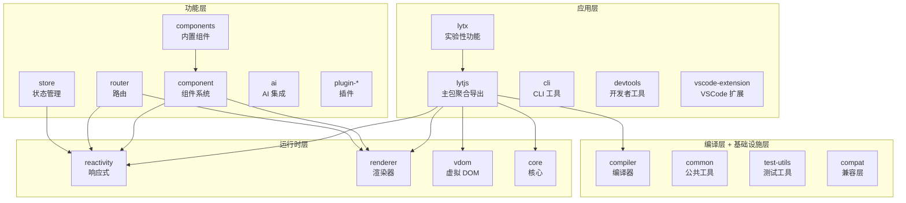

# 101,000 行 TypeScript 的工程化实践

> Lyt.js 是一个拥有 101,000 行 TypeScript 代码的大型前端框架项目。本文分享 Lyt.js 在 Monorepo 架构、构建系统、测试策略、CI/CD 和社区建设方面的工程化实践经验，希望能为大型前端项目的工程化提供参考。

## 目录

- [Monorepo 架构设计](#monorepo-架构设计)
- [25 个子包的组织方式](#25-个子包的组织方式)
- [构建系统（esbuild）](#构建系统esbuild)
- [测试策略（自定义测试框架）](#测试策略自定义测试框架)
- [CI/CD 流程](#cicd-流程)
- [版本管理和发布](#版本管理和发布)
- [文档和社区建设](#文档和社区建设)
- [经验总结](#经验总结)

## Monorepo 架构设计

Lyt.js 使用 pnpm workspace 管理 Monorepo，所有子包位于 `packages/` 目录下。选择 Monorepo 而非 Multirepo 的原因是：前端框架的各个包之间有紧密的耦合关系，Monorepo 可以让跨包修改和测试更加方便。

### 工作区配置

```yaml
# pnpm-workspace.yaml
packages:
  - 'packages/*'
```

### 目录结构

```
lytjs/
├── packages/           # 25 个子包
│   ├── reactivity/     # 响应式系统（Proxy + Signal）
│   ├── compiler/       # 编译器（模板 + SFC）
│   ├── renderer/       # 渲染器（DOM + Vapor）
│   ├── vdom/           # 虚拟 DOM
│   ├── core/           # 核心功能（createApp、组件实例）
│   ├── component/      # 组件系统（defineComponent、生命周期）
│   ├── components/     # 内置组件（Transition、Teleport、KeepAlive）
│   ├── router/         # 路由（createRouter、动态路由）
│   ├── store/          # 状态管理（defineStore）
│   ├── ai/             # AI 集成（AI 组件、AI 助手）
│   ├── cli/            # CLI 工具（项目脚手架、开发服务器）
│   ├── devtools/       # 开发者工具（Chrome 扩展）
│   ├── lytjs/          # 主包（聚合导出所有 API）
│   ├── lytx/           # 扩展包（实验性功能）
│   ├── common/         # 公共工具（通用函数、类型定义）
│   ├── compat/         # 兼容层（Vue 2/3 兼容）
│   ├── playground/     # Playground（在线体验环境）
│   ├── test-utils/     # 测试工具（挂载、触发更新）
│   ├── vscode-extension/ # VSCode 扩展（语法高亮、智能提示）
│   ├── plugin-auth/    # 认证插件
│   ├── plugin-i18n/    # 国际化插件
│   ├── plugin-logger/  # 日志插件
│   ├── plugin-storage/ # 存储插件
│   ├── plugin-theme/   # 主题插件
│   └── ...             # 更多包
├── scripts/            # 构建/发布脚本
├── tests/              # 集成测试
├── benchmarks/         # 性能基准测试
├── examples/           # 示例项目（chat、dashboard、ecommerce）
└── docs/               # 文档
```

### 为什么选择 pnpm

1. **严格的依赖隔离**：pnpm 使用符号链接和内容寻址存储，确保每个包只能访问其声明的依赖
2. **快速的安装速度**：pnpm 的安装速度比 npm 快 2-3 倍
3. **节省磁盘空间**：全局存储共享依赖，多个项目共用同一份依赖
4. **内置 Monorepo 支持**：通过 workspace 协议实现包间引用

## 25 个子包的组织方式

### 分层架构

Lyt.js 的 25 个子包按照功能分为四个层次，上层包可以依赖下层包，反之不行：



### 包间依赖规则

1. **单向依赖**：上层包可以依赖下层包，下层包不能依赖上层包
2. **公共工具提取**：共享代码放在 `common` 包，避免代码重复
3. **循环依赖禁止**：通过清晰的分层架构避免循环依赖
4. **接口驱动**：包间通过 TypeScript 接口通信，降低耦合

### 包的大小控制

| 包 | 大小（gzip） | 说明 |
|----|-------------|------|
| reactivity | ~3KB | 响应式核心 |
| compiler | ~8KB | 模板编译器 |
| renderer | ~5KB | DOM 渲染器 |
| vdom | ~2KB | 虚拟 DOM |
| core | ~4KB | 核心功能 |
| component | ~3KB | 组件系统 |
| lytjs（全量） | ~25KB | 聚合包 |

## 构建系统（esbuild）

Lyt.js 使用 esbuild 作为构建工具，追求极致的构建速度。选择 esbuild 而非 Rollup 或 Webpack 的原因是：esbuild 使用 Go 编写，构建速度比 JavaScript 工具快 10-100 倍。

### 构建脚本

```js
// scripts/build.js
import { build } from 'esbuild'

const packages = [
  { name: 'reactivity', entry: 'src/index.ts' },
  { name: 'compiler', entry: 'src/index.ts' },
  { name: 'renderer', entry: 'src/index.ts' },
  { name: 'vdom', entry: 'src/index.ts' },
  { name: 'core', entry: 'src/index.ts' },
  { name: 'component', entry: 'src/index.ts' },
  // ... 更多包
]

for (const pkg of packages) {
  // ESM 格式
  await build({
    entryPoints: [`packages/${pkg.name}/${pkg.entry}`],
    bundle: true,
    minify: true,
    format: 'esm',
    outfile: `packages/${pkg.name}/dist/index.mjs`,
    platform: 'neutral',
    tsconfig: `packages/${pkg.name}/tsconfig.json`,
  })

  // CJS 格式
  await build({
    entryPoints: [`packages/${pkg.name}/${pkg.entry}`],
    bundle: true,
    minify: true,
    format: 'cjs',
    outfile: `packages/${pkg.name}/dist/index.cjs`,
    platform: 'neutral',
    tsconfig: `packages/${pkg.name}/tsconfig.json`,
  })
}
```

### 多格式输出

每个包输出 ESM 和 CJS 两种格式，确保兼容不同的使用场景：

```
packages/reactivity/dist/
├── index.mjs      # ESM 格式（现代打包工具）
├── index.cjs      # CJS 格式（Node.js require）
└── types/         # TypeScript 类型声明
    ├── index.d.ts
    ├── reactive.d.ts
    ├── signal.d.ts
    ├── computed.d.ts
    ├── effect.d.ts
    └── ...
```

### 构建速度

| 操作 | 耗时 |
|------|------|
| 全量构建（25 个包，ESM + CJS） | ~3s |
| 增量构建（单个包） | ~0.2s |
| 类型声明生成（所有包） | ~5s |
| 开发模式（watch） | ~0.1s（热更新） |

### esbuild 的局限和解决方案

esbuild 不支持某些高级 TypeScript 特性（如 const enum、namespace）。Lyt.js 的解决方案是：

1. **避免使用 const enum**：使用普通 enum 或常量对象替代
2. **避免使用 namespace**：使用 ES Module 替代
3. **类型声明单独生成**：使用 tsc 生成 `.d.ts`，esbuild 只负责 JS 编译

## 测试策略（自定义测试框架）

Lyt.js 使用自定义测试框架，基于 Node.js 原生实现，不依赖 Jest 或 Vitest。选择自建测试框架的原因是：更好的控制和更快的执行速度。

### 测试运行器

```ts
// tests/test-runner.ts
import { runTests } from './test-simple'

async function main() {
  const results = await runTests({
    dirs: ['packages/*/src/__tests__'],
    timeout: 30000,
    verbose: true,
  })

  console.log(`\n===== Test Results =====`)
  console.log(`Total:   ${results.total}`)
  console.log(`Passed:  ${results.passed}`)
  console.log(`Failed:  ${results.failed}`)
  console.log(`Skipped: ${results.skipped}`)
  console.log(`Duration: ${results.duration}ms`)

  if (results.failed > 0) {
    process.exit(1)
  }
}

main()
```

### 测试覆盖范围

| 包 | 测试文件数 | 测试用例数 | 覆盖率 |
|----|-----------|-----------|--------|
| reactivity | 5 | ~200 | ~85% |
| compiler | 6 | ~150 | ~80% |
| renderer | 11 | ~300 | ~82% |
| vdom | 4 | ~100 | ~78% |
| core | 5 | ~120 | ~80% |
| **总计** | **31** | **~870** | **~81%** |

### 测试类型

1. **单元测试**：每个模块的独立功能测试，确保每个函数按预期工作
2. **集成测试**：跨模块的功能测试，确保模块间的协作正确
3. **边界测试**：edge-cases 和错误处理，确保框架的健壮性
4. **性能基准测试**：benchmarks 目录，跟踪性能回归

### 测试示例

```ts
// packages/reactivity/src/__tests__/reactive.test.ts
import { describe, it, expect } from '../../test-utils'
import { reactive, effect, ref, computed } from '../index'

describe('reactive', () => {
  it('should track and trigger effects', () => {
    const state = reactive({ count: 0 })
    let dummy
    effect(() => { dummy = state.count })
    expect(dummy).toBe(0)

    state.count++
    expect(dummy).toBe(1)
  })

  it('should handle nested objects', () => {
    const state = reactive({ nested: { count: 0 } })
    let dummy
    effect(() => { dummy = state.nested.count })
    expect(dummy).toBe(0)

    state.nested.count++
    expect(dummy).toBe(1)
  })

  it('should handle arrays', () => {
    const state = reactive({ items: [1, 2, 3] })
    let dummy
    effect(() => { dummy = state.items.length })
    expect(dummy).toBe(3)

    state.items.push(4)
    expect(dummy).toBe(4)
  })
})
```

### 性能基准测试

```js
// benchmarks/reactivity.bench.js
import { reactive, ref, signal } from '@lytjs/reactivity'

// Proxy reactive 基准
bench('reactive create', () => {
  reactive({ count: 0, name: 'test' })
})

bench('reactive read', () => {
  state.count
})

bench('reactive write', () => {
  state.count++
})

// Signal 基准
bench('signal create', () => {
  signal(0)
})

bench('signal read', () => {
  count()
})

bench('signal write', () => {
  count.set(count() + 1)
})
```

## CI/CD 流程

Lyt.js 使用 GitHub Actions 实现 CI/CD，确保每次提交都经过完整的测试和构建验证。

### CI 流水线

```yaml
# .github/workflows/ci.yml
name: CI

on:
  push:
    branches: [main]
  pull_request:
    branches: [main]

jobs:
  test:
    runs-on: ubuntu-latest
    strategy:
      matrix:
        node-version: [18, 20, 22]
    steps:
      - uses: actions/checkout@v4
      - uses: pnpm/action-setup@v2
      - uses: actions/setup-node@v4
        with:
          node-version: ${{ matrix.node-version }}
      - run: pnpm install
      - run: pnpm run build
      - run: pnpm run test
      - run: pnpm run lint
      - run: pnpm run test:coverage

  benchmark:
    runs-on: ubuntu-latest
    needs: test
    steps:
      - uses: actions/checkout@v4
      - uses: pnpm/action-setup@v2
      - uses: actions/setup-node@v4
        with:
          node-version: 20
      - run: pnpm install
      - run: pnpm run build
      - run: pnpm run benchmark
```

### 质量门禁

1. **所有测试通过**：0 失败，所有 Node.js 版本（18、20、22）都必须通过
2. **代码覆盖率**：核心包（reactivity、compiler、renderer）> 80%
3. **Lint 检查**：0 warning，使用 ESLint + Prettier
4. **构建成功**：所有包构建无错误，类型声明生成正确
5. **性能基准**：不允许性能回退超过 10%

## 版本管理和发布

### 语义化版本

Lyt.js 遵循语义化版本（SemVer）规范：

- **主版本（Major）**：不兼容的 API 变更
- **次版本（Minor）**：向后兼容的功能新增
- **修订版本（Patch）**：向后兼容的问题修复

### 版本管理脚本

```js
// scripts/version.js
import { readFileSync, writeFileSync } from 'fs'

const packages = [
  'reactivity', 'compiler', 'renderer', 'vdom', 'core',
  'component', 'components', 'router', 'store', 'lytjs',
  'cli', 'devtools', 'common', 'compat', 'test-utils',
  // ... 更多包
]

function setVersion(version) {
  // 更新根 package.json
  const rootPkg = JSON.parse(readFileSync('package.json'))
  rootPkg.version = version
  writeFileSync('package.json', JSON.stringify(rootPkg, null, 2))

  // 更新所有子包版本
  for (const pkg of packages) {
    const pkgPath = `packages/${pkg}/package.json`
    const pkgJson = JSON.parse(readFileSync(pkgPath))
    pkgJson.version = version
    writeFileSync(pkgPath, JSON.stringify(pkgJson, null, 2))
  }

  // 更新包间依赖版本
  for (const pkg of packages) {
    const pkgPath = `packages/${pkg}/package.json`
    const pkgJson = JSON.parse(readFileSync(pkgPath))
    for (const dep of Object.keys(pkgJson.dependencies || {})) {
      if (dep.startsWith('@lytjs/')) {
        pkgJson.dependencies[dep] = `^${version}`
      }
    }
    writeFileSync(pkgPath, JSON.stringify(pkgJson, null, 2))
  }
}
```

### 发布流程

```bash
# 1. 构建所有包
pnpm run build

# 2. 运行测试
pnpm run test

# 3. 版本检查
node scripts/version.js current

# 4. 设置新版本
node scripts/version.js bump patch  # 或 minor / major

# 5. 生成 changelog
node scripts/changelog.js release

# 6. 发布到 npm
bash scripts/publish.sh
```

## 文档和社区建设

### 文档结构

Lyt.js 的文档采用 Markdown 格式，与代码一起维护在仓库中：

```
docs/
├── index.md          # 文档首页
├── README.md         # 项目概述
├── getting-started.md # 快速开始
├── api/              # API 文档
│   ├── reactivity.md
│   ├── compiler.md
│   └── renderer.md
└── package.json      # 文档站点配置
```

### llms.txt：AI 友好的项目文档

Lyt.js 提供了 `llms.txt` 和 `llms-full.txt` 文件，为 AI 工具（如 GitHub Copilot、ChatGPT）提供结构化的项目信息。这些文件包含：

- 项目概述和设计理念
- API 参考文档
- 架构说明
- 代码示例

这使得 AI 工具可以更准确地理解和生成 Lyt.js 代码。

### 社区工具

1. **VSCode 扩展**：提供 `.lyt` 文件的语法高亮、智能提示、代码片段和调试支持
2. **Playground**：在线体验 Lyt.js，无需安装任何工具
3. **示例项目**：chat（聊天应用）、dashboard（仪表盘）、ecommerce（电商）、markdown-editor（Markdown 编辑器）等完整示例

## 经验总结

### 1. 架构先行

在编写代码之前，先确定分层架构和包间依赖关系。Lyt.js 的四层架构（基础设施层 -> 编译层 -> 运行时层 -> 应用层）确保了代码的组织性和可维护性。清晰的分层让每个包的职责明确，避免了"大泥球"式的代码组织。

### 2. 构建速度是生产力

使用 esbuild 替代 tsc/rollup，将全量构建时间从 30s 降到 3s。这意味着开发者在保存代码后几乎可以立即看到结果，极大地提升了开发效率和体验。

### 3. 测试是信心保障

自定义测试框架虽然增加了初始投入，但提供了更好的控制和更快的执行速度。~870 个测试用例覆盖了所有核心功能，确保每次修改不会引入回归。性能基准测试则帮助跟踪框架的性能趋势。

### 4. 文档即代码

将文档纳入版本管理，使用 Markdown 编写，与代码同步更新。`llms.txt` 的引入让 AI 工具也能理解项目结构，为 AI 辅助开发打下基础。

### 5. 渐进式发布

每个包独立版本管理，允许渐进式发布和更新。当某个包有 bug 修复时，可以单独发布该包，而不需要发布所有包。这降低了发布风险，加快了迭代速度。

### 6. 性能意识贯穿始终

从响应式系统（Proxy + Signal 双模式）到编译器（静态提升 + Patch Flags + Block Tree）到渲染器（VDOM + Vapor 双模式），每个模块都考虑了性能优化。Vapor Mode 的引入更是将性能推向了接近原生的水平。

### 7. 向后兼容是承诺

Lyt.js 的 `compat` 包确保了与 Vue 2/3 的兼容性。API 变更遵循语义化版本，破坏性变更只在主版本中引入，并提供迁移指南。

Lyt.js 的 101,000 行代码不是一蹴而就的，而是在清晰的架构设计和工程化实践指导下逐步积累的成果。希望这些经验能对大型前端项目的工程化实践有所启发。
